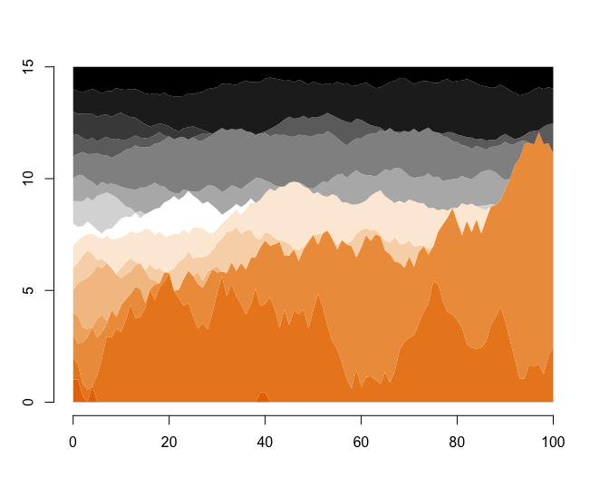
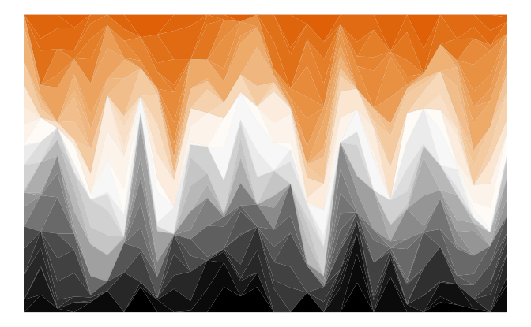

<!-- README.md is generated from README.Rmd. Please edit THIS (Rmd) file. -->

<!-- Use status badges: --> 
[](https://CRAN.R-project.org/package=unikn) 
[](https://travis-ci.org/hneth/unikn/) 
[](https://www.r-pkg.org/pkg/unikn) 
[](https://doi.org/10.5281/zenodo.7096191) 


<!-- Possible status badges: 
[](https://CRAN.R-project.org/package=unikn) 
[](https://travis-ci.org/hneth/unikn/) 
[](https://www.r-pkg.org/pkg/unikn)
[](https://www.r-pkg.org/pkg/unikn)
[](https://www.rdocumentation.org/packages/unikn/)
-->

```{r preamble, include = FALSE}
knitr::opts_chunk$set(
  collapse = TRUE,
  comment = "#>",
  fig.path = "inst/pix/README-"
)

library(unikn)  # load package
```


# unikn  

<!-- unikn pkg logo and link: --> 
<!-- <a href = "https://CRAN.R-project.org/package=unikn">

</a> 
-->

### Enabling corporate design elements in\ R {-}

The **unikn** package provides useful color functions ---\ by defining dedicated colors and color palettes, and commands for changing, viewing, and using them\ --- and styled text elements (e.g., for marking, underlining, or plotting colored titles) in\ R. 
The package's pre-defined range of colors and text functions is based on the corporate design of the [University of Konstanz](https://www.uni-konstanz.de/) (see [this link](https://www.uni-konstanz.de/en/university/news-and-media/create-online-and-print-media/corporate-design/) for details), but can easily be adapted and extended to other purposes or institutions. 

## Overview  

Institutions devise corporate designs (CDs) for creating and maintaining a consistent impression in presentations and publications. 
But even when writing an individual article or thesis, it makes sense to define some graphical elements (e.g., a color scheme) and use them consistently throughout the report. 
In\ 2014, the [University of Konstanz](https://www.uni-konstanz.de/) introduced a highly recognizable\ CD. 
Its key component is the ubiquitous use of a `Seeblau` color and a corresponding color palette that blends various shades of `Seeblau` (in boxes, lines, and other graphical elements) with text (in black-and-white). (See the [corporate design](https://www.uni-konstanz.de/en/university/news-and-media/create-online-and-print-media/corporate-design/) pages for details.) 


<!-- Goals of the unikn pgk: --> 

The **unikn** package facilitates the use of corporate design elements for users of [R](https://www.r-project.org/). 
In addition, the package provides a range of color functions that make it very easy to define, modify, find, and use colors and color palettes. 
While this renders the use of default specifications simple and straightforward, experienced users can apply the tools provided by **unikn** in a flexible and creative fashion (e.g., for designing new color palettes and using them in scientific visualizations). 

<!-- Overview: --> 

The **unikn** package currently provides five types of objects and functions: 

1. Some dedicated **colors** and **color palettes** (e.g., `Seeblau` and `pal_unikn`);  

2. Functions for **viewing and comparing colors** (`seecol()`), for **using or changing color palettes** (`usecol()`), and for **demonstrating color palettes** (`demopal()`);  
3. Functions for **creating new color palettes** (`newpal()`), for **finding similar colors** (`simcol()`), and for **searching color names** (`grepal()`);  

4. Functions for **plotting graphical objects** (e.g., boxes and frames);  
5. Functions for **plotting styled text** elements (e.g., highlighting and underlining text).  
<!-- 6. Graphical support (e.g., commands and themes for creating scientific visualizations). -->

Essentially, **unikn** began by defining some colors, but has now grown into a toolbox for addressing color- and plotting-related tasks in\ R. As we have fun creating it, we hope you find the package useful too ---\ and please use responsibly! 


## Installation

The latest release of **unikn** is available from [CRAN](https://CRAN.R-project.org/) at <https://CRAN.R-project.org/package=unikn>:

```{r install-CRAN, echo = TRUE, eval = FALSE}
install.packages('unikn')  # install from CRAN client
library('unikn')           # loads the package
```

The current development version can be installed from its [GitHub](https://github.com) repository at <https://github.com/hneth/unikn/>: 

```{r install-github, echo = TRUE, eval = FALSE}
# install.packages('devtools')  # (if not installed yet)
devtools::install_github('hneth/unikn')
library('unikn')  # loads the package
```


## Colors and color functions

A distinctive and recognizable color scheme is the most recognizable element of the [University of Konstanz](https://www.uni-konstanz.de/)'s corporate design. 

### Basic color palettes

Basic color palettes are defined according to the **Corporate Design Manual** (see the [corporate design](https://www.uni-konstanz.de/en/university/news-and-media/create-online-and-print-media/corporate-design/) specifications). 

The default color palette `pal_unikn` combines:  

- 5\ shades of `pal_seeblau` (reversed, i.e., from darker to lighter);  
- the base R color `"white"` (as the center color);  
- 4\ shades of grey (`pal_grau[1:4]`);  
- the base R color `"black"` (as the last color).   

This yields a diverging, symmetrical default color palette `pal_unikn` consisting of 11\ colors: 

```{r pal-unikn, eval = TRUE, fig.width = 6, fig.asp = .75, fig.align = 'center'}
# Default color palette: ----- 
# pal_unikn  # 11 default colors

# View color palette (by plotting it): ----- 
seecol(pal_unikn)
```

<!--  -->

- A shorter version consisting of 10\ colors is provided as\ `pal_unikn_web`. 

- An alternative color palette with 10\ more muted colors (intended for PowerPoint presentations) is provided as\ `pal_unikn_ppt`. 

Evaluating `seecol(pal = "unikn_basic")` shows these three basic unikn color palettes. 

### All color palettes

Beyond the three variants of `pal_unikn`, the **unikn** package provides the following color palettes: 

```{r pal-all, eval = TRUE, fig.align = 'center', fig.width = 5, fig.height = 5}
seecol("all")
```

The color palettes `pal_unikn_web()` and `pal_unikn_ppt()` correspond to the official definitions of color palettes for electronic and print media, respectively. The default palette `pal_unikn` of **unikn** combines the five shades of blue in `pal_seeblau` with the six non-blue colors from `pal_unikn_web()` to create a symmetrical palette of 11\ colors. 

All color palettes exported by **unikn** are built from elements consisting of nine different color hues. 
Specifically, an\ Excel file entitled [Colours for complex graphics](https://www.uni-konstanz.de/en/university/news-and-media/create-online-and-print-media/corporate-design/) defines 9\ color gradients that are created and exported by **unikn** as the following named color palettes: 

```{r pal-additional, eval = FALSE}
seecol(pal = "grad_all")
```

Overall, the **unikn** package exports 16\ dedicated color palettes, plus the nine preferred colors of `pal_unikn_pref` (e.g., `Seeblau`, `Seegruen`, etc.) as named colors. For details on each named color hue, evaluate `seecol()` on the following color palettes: 

```{r pal-additional-list, eval = FALSE}
# 8 mono-tone palettes: ----- 
# Name:          Nr:           Tone:          
pal_seeblau      # 5 shades of seeblau
pal_peach        # 5           peach
pal_grau         # 5           grau
pal_petrol       # 5           petrol
pal_seegruen     # 5           seegruen 
pal_karpfenblau  # 5           karpfenblau
pal_pinky        # 5           pink
pal_bordeaux     # 5           Bordeaux

# 1 signal (Ampel) palette: ----- 
pal_signal       # 3           signal/Ampel
```

Each color palette contains a preferred color.[^1] 
All preferred colors (i.e., named colors of distinct color hues) are contained in a corresponding color palette\ `pal_unikn_pref`: 

```{r pal-unikn-pref, eval = FALSE}
# See the palette of 9 preferred colors/hues: 
seecol(pal_unikn_pref)

# Using preferred colors:
pal_unikn_pref             # color palette of 9 preferred colors
pal_unikn_pref[1]          # preferred (named) color 1
pal_unikn_pref[[1]]        # color value 1: #59C7EB"
pal_unikn_pref["Seeblau"]  # preferred color by name
```

[^1]: Whereas the official definition does not identify a preferred color for the Ampel color palette (`pal_signal`), 
we provide its alert color (i.e., `pal_signal[2]`) as a designated color\ `Signal`. 

Additional pre-defined color palettes in **unikn** include:

```{r pal-unikn-more, eval = FALSE}
# See additional color palettes:
seecol(pal_unikn_light)  # palette of  8 light colors (in 4 pairs)
seecol(pal_unikn_dark)   # palette of  8 dark colors (in 4 pairs)
seecol(pal_unikn_pair)   # palette of 16 paired colors (in 8 pairs)
```

More flexible and complex color palettes can be created by using the `seecol()` and `usecol()` functions. 


### Overview of color-related functions

Two main functions ---\ `seecol()` and `usecol()`\ --- provide a simple interface for _viewing_ and _using_ color palettes. 

Additional color functions (i.e., `newpal()`, `grepal()`, `shades_of()`, and `ac()`) provide auxiliary functionality (like creating new color palettes, finding colors whose names match some pattern, creating color gradients, or adding transparency to colors). 


### Viewing color palettes with `seecol()` 

The `seecol()` function enables a quick inspection of a color palette. 
It provides a quick overview over the details of a color palette and allows comparisons between multiple color palettes: 

```{r seecol-pref, eval = TRUE, fig.align = 'center', fig.width = 7, fig.asp = .80}
# Plot a color palette: 
seecol(pal = pal_unikn_pref,            # a color palette to plot
       hex = TRUE,                      # show HEX code of colors?
       col_brd = "white", lwd_brd = 5)  # color and width of borders
```

#### Partial color palettes

When only a subset of a color palette are needed, the `seecol()` and `usecol()` functions provide a reasonable subset of a known **unikn** color palette: 

```{r pal-n, eval = TRUE, fig.width = 5, fig.asp = .75, fig.align = 'center', collapse = TRUE}
# Subset of all color palettes: 
seecol(n = 4)

# Details of a partial palette: 
# seecol(pal_seeblau, n = 4)
```

#### Changing and creating color palettes

The `usecol()` and `seecol()` functions provide some generic options for manipulating and showing color gradients based on given colors or color palettes. This serves two main functions: 

1. Reducing or extending existing color palettes (to arbitrary lengths). 
2. Mixing and merging colors and color palettes into new color palettes. 

Here are some examples of both functions in action: 

- Extending or reducing an existing color palette:

```{r col-scale-1, eval = TRUE, fig.width = 6, fig.asp = .75, fig.align = 'center', collapse = TRUE}
seecol(pal_unikn, n = 21)  # extend a color palette
```

Users of the `%>%` operator (from the **magrittr** package) may prefer the following pipe:

```{r col-scale-1-pipe, eval = FALSE}
library(magrittr)

usecol(pal_unikn, n = 21) %>% seecol()
```

Note that reducing an **unikn** color palette selects a suitable subset of its colors, rather than just truncating the scale. 

```{r col-scale-1-reduce-unikn-pals, echo = FALSE, eval = FALSE}
seecol(pal_unikn, n = 4)  # provides a subset of "good" colors
```

<!-- 

- Combining colors to create new color palettes (of arbitrary length): 

```{r col-scale-2, eval = TRUE, out.width = "67%", fig.asp = .75, fig.align = 'center', collapse = TRUE}
# Combining colors: ----- 
seecol(c(Seeblau, "white", Pinky), 11) 
# seecol(c(Karpfenblau, Seeblau, "gold"), 10) 
```

--> 

- Mixing and merging colors and visualizing color palettes is possible on the fly: 

```{r col-scale-3, eval = TRUE, fig.width = 6, fig.asp = .75, fig.align = 'center', collapse = TRUE}
seecol(c(rev(pal_petrol), "white", pal_bordeaux), 11, col_bg = "grey90")
```

Related examples include:

```{r col-scale-3-examples, eval = FALSE, fig.width = 6, fig.asp = .75, fig.align = 'center', collapse = TRUE}
seecol(c(rev(pal_seeblau), "white", pal_pinky), 11)
seecol(c(rev(pal_seeblau), "white", pal_seegruen), 11)
seecol(c(rev(pal_seeblau), "white", pal_peach), 11)
```


### Using color palettes with `usecol()` 

The `usecol()` function provides convenient access and additional options for using them in graphs. 
Here are some examples:  

#### 1. Plotting with **base** R

All **unikn** colors, palettes and functions can be used in **base** R plots (using the **graphics** and **grDevices** packages). 

By default, set the plot's color argument to `usecol()` with some **unikn** color palette: 

```{r usepal-demo-barplot-1, eval = TRUE, fig.width = 5, fig.asp = .65, fig.align = 'center', collapse = TRUE}
# (a) Using a color palette:
barplot(1/sqrt(1:11),  col = usecol(pal_unikn))
```

Two additional arguments allow modifying the existing color palette: 

- providing a value for\ `n` reduces or extends the selected color palette; 

- adding an opacity value for `alpha` (in the range `[0, 1]`) regulates color transparency. 

<!-- 
Additionally providing a value for `n` either reduces or extends the selected color palette: 

```{r usepal-demo-barplot-2, eval = TRUE, out.width = "50%", fig.asp = .65, fig.align = 'center', collapse = TRUE}
# (b) Using only n colors of a palette:
barplot(1/sqrt(1:5), col = usecol(pal_unikn, n = 5)) 
```

Providing an opacity value for `alpha` (in the range `[0, 1]`) allows adding transparency to a plot:  

```{r usepal-demo-scatter, eval = TRUE, out.width = "40%", fig.asp = 1, fig.align = 'center', collapse = TRUE}
# (c) Scatterplots:
set.seed(-99)
plot(x = runif(99), y = runif(99), "p", pch = 16, cex = 6, 
     col = usecol(pal_unikn, alpha = .5),  # transparency
     main = "99 transparent dots", axes = FALSE, xlab = NA, ylab = NA)
```

-->

Visualizing **unikn** color palettes with `image()` (from the **graphics** package) works as well: 

```{r use-pal-demo-image, eval = TRUE, fig.width = 3.5, fig.height = 4, fig.show = 'hold', fig.align = 'center'}
# Random images:
set.seed(1)
n <- 20
m <- matrix(rnorm(n*n), ncol = n, nrow = n)

image(m, col = usecol(pal_seeblau, n = 50), 
      main = "50 shades of Seeblau", axes = FALSE)
```

```{r use-pal-demo-image-2, echo = FALSE, eval = FALSE, fig.width = 3.5, fig.height = 4, fig.show = 'hold', fig.align = 'center'}
# Alternative image() commands:
# image(m, col = seecol(pal_seeblau))  # seecol() shows & use colors 
# image(m, col = usecol(pal_peach))    # usecol() only uses colors
# image(m, col = usecol(pal_seegruen))
# image(m, col = usecol(pal_petrol))

# Mix pal_seeblau and pal_seegruen:
x <- y <- seq(-4 * pi, 4 * pi, len = 15)
r <- sqrt(outer(x^2, y^2, "+"))
image(z = cos(r^2) * exp(-r/6), col = usecol(c(pal_petrol, pal_seegruen), n = 10), 
      main = "Shades of Petrol/Seegruen", axes = FALSE)
```

#### 2. Plotting with **ggplot2**

Using **unikn** in `ggplot()` commands (using **ggplot2**) or using colors from other color packages (e.g., **RColorBrewer**) is easy as well. 
Just wrap the color palette to use in `usecol()` (and scale or change transparency as needed): 

```{r use-pal-ggplot2, eval = FALSE, out.width = "55%", fig.asp = .618, fig.align = 'center', collapse = TRUE}
# 0. Create data: ---- 

# Example based on https://www.r-graph-gallery.com/137-spring-shapes-data-art/
n <- 50
names <- paste("G_", seq(1, n), sep = "")
df <- data.frame()

set.seed(3)
for(i in seq(1:30)){
    data = data.frame(matrix(0, n, 3))
    data[, 1] <- i
    data[, 2] <- sample(names, nrow(data))
    data[, 3] <- prop.table(sample( c(rep(0, 100), c(1:n)), nrow(data)))
    df = rbind(df, data)}
colnames(df) <- c("X","group","Y")
df <- df[order(df$X, df$group) , ]

# 1. Choose colors: ---- 

# (a) using RColorBrewer: 
library(RColorBrewer)
cur_col <- brewer.pal(11, "Paired") 
cur_col <- colorRampPalette(cur_col)(n)
cur_col <- cur_col[sample(c(1:length(cur_col)), size = length(cur_col))]  # randomize

# (b) using unikn:
library(unikn)
cur_col <- usecol(pal_unikn, n = n)
# cur_col <- cur_col[sample(c(1:length(cur_col)), size = length(cur_col))]  # randomize

# 2. Plot: ---- 
library(ggplot2)

ggplot(df, aes(x = X, y = Y, fill = group)) + 
  geom_area(alpha = 1, color = Grau, size = .01 ) +
  theme_bw() + 
  scale_fill_manual(values = cur_col) +
  theme_void() +
  theme(legend.position = "none")
```

<!-- Image: ggplot2 with pal_unikn palette as link (in HTML): -->

<p style="text-align:center;">

</p>


### Creating color palettes with `newpal()`

The `newpal()` function allows creating new color palettes (typically as data frames with dedicated color names). 

The color palettes included in the **unikn** package are based on the CD\ manual of the [University of Konstanz](https://www.uni-konstanz.de/), Germany. However, the functionality provided by the package makes it easy and straightforward to define and use your own color scales. 
In the following, we provide examples to illustrate how this can be achieved for other corporations or institutions. 

#### The colors of Princeton University 


The color scheme of [Princeton University](https://princeton.edu/) is easily recognized by its combination of orange with black and white elements. The official guidelines (available [here](https://communications.princeton.edu/guides-tools/logo-graphic-identity)) define "Princeton Orange" as Pantone (PMS) 158\ C. 

- The PANTONE&trade; color finder at <https://www.pantone.com/connect/158-C> yields the following color values:

    - RGB: `232 119 34`  
    - HEX/HTML: `#E87722`  
    - CMYK: `0 62 95 0`  

- However, the guide also specifies and distinguishes between two additional versions of orange and provides the following HEX/HTML values for them:  

    - Orange on white: "#E77500"  
    - Orange on black: "#F58025"  

These definitions suggest defining three separate versions of orange and corresponding color palettes: 

```{r uni-princeton-cols, out.width = "67%", fig.asp = .75, fig.align = 'center', fig.show = "hold", collapse = TRUE}
# HEX values for 3 shades of orange: 
orange_basic <- "#E87722"  # Pantone 158 C
orange_white <- "#E77500"  # orange on white
orange_black <- "#F58025"  # orange on black

# Defining color palettes:
pal_princeton <- c(orange_basic, "black")
names(pal_princeton) <- c("orange", "black")

pal_princeton_1 <- c(orange_white, "white", "black")
names(pal_princeton_1) <- c("orange_w", "white", "black")

pal_princeton_2 <- c(pal = c(orange_black, "black", "white"))
names(pal_princeton_2) <- c("orange_b", "black", "white")
```

Alternatively, we can define both (color values and their names) in one step by using the `newpal()` function:

```{r uni-Princeton-newpal}
pal_princeton_1 <- newpal(col = c("#E77500", "white", "black"),
                          names = c("orange_w", "white", "black"))
```

A new color palette can now be evaluated with `seecol()`, scaled by `usecol()`, and used in graphs (e.g., using `demopal()` or `ggplot()`): 

```{r uni-princeton-demopal, eval = FALSE, fig.width = 6, out.width = "65%", fig.asp = .80, fig.align = 'center', collapse = TRUE}
# View color palette: 
# seecol(pal_princeton_1)  

# Scale color palette:
my_pal <- usecol(pal_princeton_1, n = 15)

# Use my_pal for plotting: 
demopal(my_pal, type = "polygon", col_par = NA, main = NA, seed = 10)
```

<!-- Image: demopal() with Princeton palette: -->

<p style="text-align:center;">

</p>


```{r uni-princeton-ggplot, echo = FALSE, eval = FALSE}
# Previous plot (using df and ggplot): ----
ggplot(df, aes(x = X, y = Y, fill = group)) + 
  geom_area(alpha = 1, color = Grau, size = .01 ) +
  theme_bw() + 
  scale_fill_manual(values = my_pal) +
  theme_void() +
  theme(legend.position = "none")
```

<!-- Image: ggplot2 with Princeton palette as link (in HTML): -->

<!-- <p style="text-align:center;"> -->
<!--  -->
<!-- </p> -->


#### The colors of Google 

Color palettes for other entities and purposes can easily be created. 
To illustrate the steps involved, let's create a color palette of the well-known [Google](https://www.google.com/) logo. 

The typical steps of creating a new palette are: 

1. Choose some colors (and their R color names, or as RGB/HEX/HCL values, e.g., from sites like <https://www.schemecolor.com>). 

2. Define the colors as an\ R vector (of type character). 

3. Define their names as a second R vector (of type character). 

4. Use the `newpal()` command to define the new color palette. 

5. Use the `seepal()` command to inspect the new color palette. 


```{r newpal-google, fig.width = 5, fig.asp = .9, fig.align = 'center'}
# 1. Choose colors:
# Google logo colors (from <https://www.schemecolor.com/google-logo-colors.php>)

# 2. Define colors (as vector):
color_google <- c("#4285f4", "#34a853", "#fbbc05", "#ea4335")

# 3. Define color names (as vector):
names_google <- c("blueberry", "sea green", "selective yellow", "cinnabar")

# 4. Define color palette:
pal_google <- newpal(color_google, names_google)

# 5. Inspect color palette:
seecol(pal_google, 
       col_brd = "white", lwd_brd = 8,
       main = "Colors of the Google logo")
```

The new palette `pal_google` can now be used in R graphics and modified in various ways (e.g., by the `usecol()` function). 

See the vignette on "Institutional colors" of the **unikn** package for additional examples. 


### Finding colors with `grepal()`

The `grepal()` function allows finding colors in a color palettes by matching their name to a pattern.

Specifically, `grepal(pattern, x)` searches a color palette\ `x` (i.e., a vector of color names or data frame of named colors) for elements that match a `pattern` and returns those elements (colors) that match the pattern. The `pattern` can be a regular expression. 

By default, `grepal()` searches the `r length(colors())`\ named colors provided by `colors()` in **base**\ R: 

```{r grepal-example-1, fig.width=5, fig.asp=.9, fig.align = 'center'}
# Find colors matching a pattern: 
oranges <- grepal("orange", plot = FALSE)

# See color palette:
seecol(oranges, 
       col_brd = "white", lwd_brd = 2, 
       main = "Shades of 'orange' in colors()")
```

Providing a list of color palettes to the `pal` argument of the `seecol()` function allows comparing multiple color palettes: 

```{r grepal-example-2, fig.width=8, fig.asp=.30, fig.align = 'center'}
# Find colors:
pink_olive    <- grepal("(pink)|(olive)", plot = FALSE)
purple_orange <- grepal("(purple)|(orange)", plot = FALSE)

# See color palettes:
seecol(pal = list(pink_olive, purple_orange), 
       pal_names = c("pink|olive", "purple|orange"), 
       main = "Comparing pink olives and purple oranges")
```

To make the `grepal()` more flexible, its `pattern`\ argument can use regular expressions, and its `x`\ argument works with both vectors and data frames (e.g., the **unikn** color palettes). 


## Text decorations

Beyond color functions, **unikn** provides additional functions for plotting graphical elements (like boxes) and styled text (with decorations like colored backgrounds or underlining). 
By default, the text-decoration functions assume that you want to add styled text to an existing plot, unless the `new_plot` argument specifies a type of plot to be generated. 
As the use of these functions is explained in detail in `vignette("Text")`, we only provide some examples here: 

### Mark

The `mark()` function allows emphasizing text by plotting it with colored background (to provide the functionality of "Markieren"):  

```{r mark-new-plot, echo = TRUE, eval = TRUE, fig.align = 'center', fig.width = 3, fig.height = 3}
mark(labels = c("Markieren", "ist ein Bestandteil", "von Studieren."), 
     x = 0, y = .8, y_layout = .03, cex = 1.5, new_plot = "slide")
```

### Underline

The `uline()` function allows emphasizing text by plotting it with colored underlining (to provide the functionality of "Unterstreichen"):  

```{r uline-demo, echo = TRUE, eval = TRUE, fig.align = 'center', fig.width = 3, fig.height = 3}
uline(labels = c("Geradlinig", "Authentisch", "Beweglich", "Offen", "Paradiesisch"), 
      x = .05, y = .9, y_layout = "even", cex = 1.1, font = 2, new_plot = "slide")
```

### Post

The `post()` function allows adding text to a rectangular `xbox` (to provide the functionality of "Merken"):  

```{r post-demo-1, echo = TRUE, eval = TRUE, fig.align = 'center', fig.width = 2, fig.height = 2}
xbox(col = usecol(pal_seeblau[[5]]), dim = c(2, 2))
post(labels = c("Für eine", "Kultur der", "Kreativität"), x = .1, y = .8, cex = 1.4, font = 2)
```

The color and font parameters can be adjusted to obtain different looks:  

```{r post-demo-2, echo = TRUE, eval = TRUE, fig.align = 'center', fig.width = 2, fig.height = 2}
post(labels = c("creative.", "together"), new_plot = "xbox", 
     y_layout = .02, cex = 2, font = c(1, 3),  
     col_bg = pal_seegruen[[1]], col = c(Petrol, Pinky))
```

### Headings

The `heading()` function is a convenient wrapper around `mark`:  

```{r heading-demo-1, echo = TRUE, eval = TRUE, fig.align = 'center', fig.width = 2, fig.height = 3}
heading(labels = c("pa-", "ra-", "die-", "sisch"))
```

Headings violating the official recommendations (e.g., step-wise titles) will generate a message: 

```{r heading-demo-2, echo = TRUE, eval = TRUE, fig.align = 'center', fig.width = 3, fig.height = 3}
heading(labels = c("Ewig", "währt am", "längsten..."), 
        y = 2/3, col_bg = usecol(pal_pinky))
```

### URLs

Finally, the `url_unikn()` function allows formatting URLs the uni.kn way: 

```{r url-post, echo = TRUE, eval = TRUE, fig.align = 'center', fig.width = 2, fig.height = 2}
my_url <- url_unikn("https://www.uni-konstanz.de/")  # input URL as copied from web browser

post(labels = my_url, x = .2, y = .1, font = 4, new_plot = "xbox")
```

### Using custom color palettes 

<!-- Uni Freiburg: -->

```{r freiburg-cols, echo = FALSE}
# Source: http://portal.uni-freiburg.de/cmsforum/wsg/webstyleguide/farben

# Basic colors: ----

pal_freiburg_bluered <- c("#004a99", "#c1002a")
names(pal_freiburg_bluered) <- c("uni-blau", "uni-rot")

pal_freiburg_basic <- c("#004a99", "white", "#c1002a")  # add "white" for better gradients
names(pal_freiburg_basic) <- c("uni-blau", "weiss", "uni-rot")

# Web colors: ----

pal_freiburg_blue <- c("#004a99", "#2a6ebb", "#6f9ad3")
names(pal_freiburg_blue) <- c("blue-1", "blue-2", "blue-3")

pal_freiburg_grey <- c("#f2f3f1", "#e0e1dd", "#d5d6d2", "#c9cac8", 
                       "#b2b4b3", "#9a9b9c", "#747678", "#363534")
names(pal_freiburg_grey) <- c("grey-0", "grey-1", "grey-2", "grey-3", 
                              "grey-5", "grey-7", "grey-9", "grey-font")

pal_freiburg_info <- c("#2a6ebb", "#a7c1e3", "#7b2927", "#de3831", "#739600", "#92d400", 
                       "#4d4f53", "#747678", "#b2b4b3", "#d5d6d2", "#e98300", "#efbd47")
names(pal_freiburg_info) <- c("mid-blau", "hell-blau", "dark-red", "hell-red", "mid-green", "hell-green", 
                              "anthrazit", "dark-grey", "mid-grey", "hell-grey", "orange", "gelb")
```

<!-- MPG:  -->

```{r mpg-cols, echo = FALSE}
# Define vectors:
col_mpg <- c("#007367", "white", "#D0D3D4")     # color definition 
col_lbl <- c("mpg green", "white", "mpg grey")  # color names

# Create new color palette:
pal_mpg <- newpal(col = col_mpg, names = col_lbl, as_df = TRUE)
# seecol(pal_mpg)
# seecol(usecol(pal_mpg, n = 7))
# seecol(usecol(pal_mpg, n = 7)[3:1])
```

If custom color palettes are available, the text decoration functions can be used for graphical annotations. 

- For instance, using color palettes of other academic institutions (defined in the vignette on "Institutional colors"): 

```{r others-txt-demo, echo = FALSE, eval = TRUE, fig.align = 'center', fig.width = 4.5, fig.height = 3}
x_pos <- .70

# A. Using pal_freiburg_basic and pal_freiburg_blue: 
uline(labels = c("University of Freiburg"), 
      x = x_pos, y = .85, font = 2, cex = 1, 
      col = pal_freiburg_basic[[1]], col_bg = pal_freiburg_basic[[3]], 
      new_plot = "slide")
mark(labels = c("Die Wahrheit", "wird euch", "frei machen."), 
     x = 0, y = .90, y_layout = 0, cex = 1.2, 
     col = c("white"), col_bg = rev(usecol(pal_freiburg_blue, 3)))

# B. Using orange_white or pal_princeton:
uline(labels = c("Princeton University"), 
      x = x_pos, y = .55, font = 2, cex = 1, col_bg = orange_white)
mark(labels = c("Go", "tigers!"), 
     x = 0, y = .58, y_layout = 0, cex = 1.2,  
     col = c("black", "white"), col_bg = pal_princeton)

# C. Using pal_mpg:
uline(labels = c("Max Planck Society"), 
      x = x_pos, y = .25, font = 2, cex = 1, col_bg = usecol(pal_mpg, 1), col = "black")
mark(labels = c("Dem Anwenden", "muss das Erkennen", "vorausgehen."), 
     x = 0, y = .30, y_layout = 0, cex = 1.2, 
     col = c("white"), col_bg = usecol(pal_mpg, 7)[3:1])
```

- Using the color palette `pal_google` (defined above): 

```{r others-google, echo = FALSE, fig.align = 'center', fig.width = 3, fig.height = 2.5}
# D. Google
# seecol(pal_google)  # defined above

slide(col = pal_google[1], border = NA)

uline(labels = c("Google"), 
      x = .75, y = .50, font = 2, cex = 1.4,
      col = "white", col_bg = pal_google[3])

mark(labels = c("Don't", "be", "evil."), 
     x = 0, y = .75, y_layout = 0, cex = 2.8,
     col = "white", col_bg = usecol(pal_google[c(2:4)]))
```


### Caveats

Please note the following caveats:

- Plotting text (i.e., graphically rendering characters) is rarely a good idea. It typically doesn't scale (when changing the size of images) and cannot be recognized automatically (e.g., copied, indexed, or scraped). Hence, the corresponding **unikn** functions should only be used in contexts in which no better solutions are available or practical (e.g., when specifically creating images, or adding annotations to graphs). 

- Like all templates, our offers are subject to constraints and limitations. 
As a standard installation of\ R lacks the "Theinhardt" fonts, we can only mimic the official design specifications (in Arial, sans serif). 
Nevertheless, the **unikn** package helps preventing common mistakes by novices (e.g., boxes or lines extending beyond text, or step-functions in multi-line titles) and can be customized and improved by expert users. 

Overall, the **unikn** functions can be useful for solving color-related tasks and plotting graphical elements (e.g., boxes, logos, etc.). Ideally, it should help you in creating a stylish and recognizable design for your presentations and visualizations.


## ToDo 


The **unikn** package is work in progress. We are still working on:

- Additional themes for **ggplot2** that use the **unikn** color palettes    
- Additional templates for images and slides  
   
Please [contact us](https://www.spds.uni-konstanz.de/) in case you need additional features or want to help us implementing them.  


## Resources

The following versions of **unikn** and corresponding resources are currently available: 

Type:                    | Version:           | URL:                           |         
:------------------------|:-------------------|:-------------------------------| 
A. **unikn** (R package): | [Release version](https://CRAN.R-project.org/package=unikn) | <https://CRAN.R-project.org/package=unikn> |
    &nbsp;                | [Development version](https://github.com/hneth/unikn/)       | <https://github.com/hneth/unikn/> | 
B. Online documentation:  | [Release version](https://hneth.github.io/unikn/)            | <https://hneth.github.io/unikn/> | 
    &nbsp;                | [Development version](https://hneth.github.io/unikn/dev/)    | <https://hneth.github.io/unikn/dev/> | 


## Contact

Please report any **unikn**-related issues at <https://github.com/hneth/unikn/issues>. 
We appreciate your feedback, comments, or questions. 

## Copyrights 

<!-- uni.kn logo and link: -->  
<!--  --> 
<a href = "https://www.uni-konstanz.de/">

</a>

The [University of Konstanz's Corporate Design](https://www.uni-konstanz.de/en/university/news-and-media/create-online-and-print-media/corporate-design/)\ (CD) was created by [Strichpunkt GmbH](https://www.strichpunkt-design.de/) and the [University of Konstanz](https://www.uni-konstanz.de/) in\ 2014. 
The **unikn** package authors are members of the research group [Social Psychology and Decision Sciences](https://www.spds.uni-konstanz.de/) (SPDS) at the [University of Konstanz](https://www.uni-konstanz.de/). We facilitate access to CD elements for fellow users of\ R (e.g., for creating scientific visualizations), but all copyrights on the design remain with the original copyright holders. 

We aim for an authentic representation of a highly-specified corporate design. While rigid specifications help to maintain coherence and consistency, they also tend to cause frustration in expert users. As the design has been developed in a flexible way that allows for individual elements to be modified as needed, we allow for some liberties, mostly by relaxing some restrictions. Examples include: 

- enabling finer color gradients and arbitrary combinations of color palettes (by applying the `seecol()` and `usecol()` functions to color palettes);  
- providing a designated `Signal` color (from `pal_signal`);  
- using the spelling "color" (rather than "colour")  throughout the **unikn** package.  


### License

<!-- unikn pkg logo and link: -->
<a href = "https://CRAN.R-project.org/package=unikn">

</a>

<!-- License: CC BY-SA 4.0 (also in Description) -->

<!-- Image with link: --> 

<a rel="license" href="https://creativecommons.org/licenses/by-sa/4.0/"></a>

<!-- Text with links: --> 

<span xmlns:dct="https://purl.org/dc/terms/" property="dct:title"><strong>unikn</strong></span> by <a xmlns:cc="https://creativecommons.org/ns#" href="https://github.com/hneth/unikn" property="cc:attributionName" rel="cc:attributionURL">Hansjörg Neth and Nico Gradwohl</a> is licensed under a <a rel="license" href="https://creativecommons.org/licenses/by-sa/4.0/">Creative Commons Attribution-ShareAlike 4.0 International License</a>. (Based on a work at <a xmlns:dct="https://purl.org/dc/terms/" href="https://github.com/hneth/unikn" rel="dct:source">https://github.com/hneth/unikn</a>).


### Citation and References

To support our development, please cite the **unikn** package when using it in publications or derivations:

<!-- Citation (in APA format): -->

- Neth, H., & Gradwohl, N., (2022). 
unikn: Graphical elements of the University of Konstanz's corporate design. 
Social Psychology and Decision Sciences, University of Konstanz, Germany.
Computer software (R package version 0.6.0, September 20, 2022). 
Retrieved from <https://CRAN.R-project.org/package=unikn>.   
[https://doi.org/10.5281/zenodo.7096191](https://doi.org/10.5281/zenodo.7096191)


<!-- Copyrights of designs: -->

The copyrights to all designs remain with their original creators:   

- Universität Konstanz, © 2015, Version 1.6, 21. September 2015, [`r url_unikn("https://www.uni-konstanz.de/")`](https://www.uni-konstanz.de/) 
- Strichpunkt GmbH, [`r url_unikn("https://www.strichpunkt-design.de/")`](https://www.strichpunkt-design.de/) 

Color and text box definitions are based on the following [corporate design at uni.kn](https://www.uni-konstanz.de/en/university/news-and-media/create-online-and-print-media/corporate-design/) specifications:  

- [The University of Konstanz’s corporate design](https://www.uni-konstanz.de/en/university/news-and-media/create-online-and-print-media/corporate-design/the-university-of-konstanzs-corporate-design/) 
- [Colours for complex graphics](https://www.uni-konstanz.de/en/university/news-and-media/create-online-and-print-media/corporate-design/colours-for-complex-graphics/)

------ 

<!-- Footer: -->

[File `README.md` updated on `r Sys.Date()`.]

<!-- eof. -->