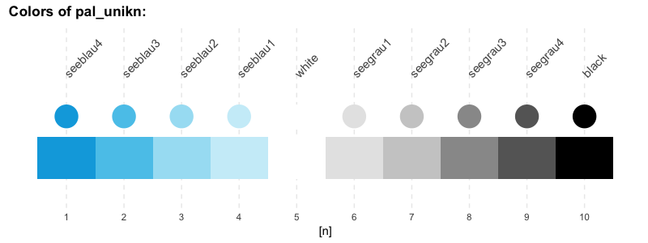

<!-- README.md is generated from README.Rmd. Please edit THIS (Rmd) file. -->
unikn
=====

<!-- uni.kn logo and link: -->
<!--  -->
<a href="https://www.uni.kn/">  </a>

The `unikn` package provides some elements of the [University of Konstanz](https://www.uni-konstanz.de/)'s corporate design in R.

See the official [brand information](https://www.uni-konstanz.de/en/university/news-and-media/create-online-and-print-media/corporate-design/) and the **Corporate Design Manual** [(pdf)](https://www.uni-konstanz.de/typo3temp/secure_downloads/57014/0/0143c03b80bd1fa99843c8f8686f806305928078/UKN_CD_Manual_150921.pdf) for details.

Installation
------------

The current development version can be installed from its [GitHub](https://github.com) repository at <https://github.com/hneth/unikn/>:

``` r
# install.packages('devtools')
devtools::install_github('hneth/unikn')

library(unikn)  # load package
```

Colors
------

A distinctive and recognizable color scheme is the most obvious element of the [University of Konstanz](https://www.uni-konstanz.de/)'s corporate design.

### Basic color palette

Basic color palettes are specified according to the **Corporate Design Manual** [(pdf)](https://www.uni-konstanz.de/typo3temp/secure_downloads/57014/0/0143c03b80bd1fa99843c8f8686f806305928078/UKN_CD_Manual_150921.pdf):

``` r
# Default color palette:
pal_unikn      # 10 default colors (web/sRGB)

# Plot a color palette:
plot_pal(pal = pal_unikn)
```



### Additional color palettes

Additional colors are defined in an Excel file on [Colours for complex graphics](https://www.uni-konstanz.de/en/university/news-and-media/create-online-and-print-media/corporate-design/colours-for-complex-graphics/)

``` r
pal_seeblau
#>   seeblau1 seeblau2 seeblau3 seeblau4 seeblau5
#> 1  #CCEEF9  #A6E1F4  #59C7EB  #00A9E0  #008ECE
pal_peach
#>    peach1  peach2  peach3  peach4  peach5
#> 1 #FEE2DD #FECFC7 #FFB8AC #FEA090 #FF8E7B
# etc.
```

Using all preferred colors:

``` r
# Using preferred colors:
pal_unikn_pref             # color palette of preferred colors
#>   seeblau   peach
#> 1 #59C7EB #FEA090
pal_unikn_pref[1]          # preferred (named) color 1
#>   seeblau
#> 1 #59C7EB
pal_unikn_pref[[1]]        # color value 1: #59C7EB"
#> [1] "#59C7EB"
pal_unikn_pref["seeblau"]  # preferred color by name
#>   seeblau
#> 1 #59C7EB
```

### Subsets of a color palette

When only a subset of a color palette are needed, the function `pal_n` provides a reasonable subset of a known color palette:

``` r
# From pal_unikn:
pal_n(n = 2)
#>   seeblau4 seeblau2
#> 1  #00A9E0  #A6E1F4
pal_n(n = 4)
#>   seeblau4 seeblau2   white   black
#> 1  #00A9E0  #A6E1F4 #FFFFFF #000000

# From pal_seeblau:
pal_n(n = 1, pal = pal_seeblau)
#>   seeblau3
#> 1  #59C7EB
pal_n(n = 4, pal = pal_seeblau)
#>   seeblau4 seeblau3 seeblau2 seeblau1
#> 1  #00A9E0  #59C7EB  #A6E1F4  #CCEEF9
```

Note
----

The [University of Konstanz’s Corporate Design](https://www.uni-konstanz.de/en/university/news-and-media/create-online-and-print-media/corporate-design/the-university-of-konstanzs-corporate-design/) was created by the [University of Konstanz](http://www.uni-konstanz.de) and [Strichpunkt GmbH](https://www.strichpunkt-design.de/) and introduced in 2014. We do not hold any copyrights on the design elements, but make some of them available to users of R (e.g., for creating scientific visualizations).

We aim for an authentic representation of a highly-specified corporate design. While very rigid specifications may help to maintain consistency and coherence, they can also cause frustration in expert users. As the design has been developed in a flexible way that allows for individual elements to be modified as needed, we occasionally allow ourselves some liberties, mostly by imposing fewer restrictions. Examples include:

-   More flexible combinations of color palettes.
-   Using the term "color", rather than "colour".

References
----------

Copyrights of design elements:

-   © 2015 Universität Konstanz, Version 1.6, 21. September 2015, [-uni-konstanz.de](https://www.uni-konstanz.de)

-   Strichpunkt GmbH, [-strichpunkt-design.de](https://www.strichpunkt-design.de/)

Color definitions are based on the following sources:

-   [Corporate Design Manual (pdf)](https://www.uni-konstanz.de/typo3temp/secure_downloads/57014/0/0143c03b80bd1fa99843c8f8686f806305928078/UKN_CD_Manual_150921.pdf)

-   [Colours for complex graphics (xls)](https://www.uni-konstanz.de/en/university/news-and-media/create-online-and-print-media/corporate-design/colours-for-complex-graphics/)

<!-- Update: -->
\[Updated 2019-02-17 by [hn](https://neth.de).\]

<!-- eof. -->
