<!-- README.md is generated from README.Rmd. Please edit THIS (Rmd) file. -->
unikn
=====

<!-- unikn pkg logo and link: -->
<a href = "https://github.com/hneth/unikn/">  </a>

The **unikn** package enables the use some elements of the [University of Konstanz](https://www.uni-konstanz.de/)'s corporate design for users of [R](https://www.r-project.org/). For instance, it provides a range of beautiful color palettes for scientific visualizations that are consistent with the [University of Konstanz](https://www.uni-konstanz.de/)'s [corporate design specifications](https://www.uni-konstanz.de/en/university/news-and-media/create-online-and-print-media/corporate-design/colours-for-complex-graphics/).

Motivation
----------

<!-- uni.kn logo and link: -->
<!--  -->
<a href = "https://www.uni.kn/">  </a>

<!-- unikn CD: -->
In 2014, the [University of Konstanz](https://www.uni-konstanz.de/) introduced a highly recognizable corporate design. Its key component is the consistent use of a `Seeblau` color and a corresponding color palette that blends various shades of `Seeblau` (in boxes, lines, and other graphical elements) with text (in black-and-white). (See the official [brand information](https://www.uni-konstanz.de/en/university/news-and-media/create-online-and-print-media/corporate-design/) and the [Corporate Design Manual (pdf)](https://www.uni-konstanz.de/typo3temp/secure_downloads/57014/0/0143c03b80bd1fa99843c8f8686f806305928078/UKN_CD_Manual_150921.pdf) for details.)

<!-- Goals of the unikn pgk: -->
The **unikn** package aims to facilitate the use of some design elements for users of [R](https://www.r-project.org/). While the correct use of default specifications should be simple and straightforward, we also allow some flexibility for expert users (e.g., for creators of scientific visualizations).

<!-- Overview: -->
The package currently provides 4 types of objects or functions:

1.  Colors, color palettes, and related functions
2.  Plotting styled graphical objects (e.g., boxes and frames)
3.  Plotting styled text elements (e.g., highlighting and underlining)
4.  Graphical support (e.g., commands and themes for creating scientific visualizations)

Additional elements are added as they become available. Please use responsibly!

Installation
------------

The current development version can be installed from its [GitHub](https://github.com) repository at <https://github.com/hneth/unikn/>:

``` r
# install.packages('devtools')
devtools::install_github('hneth/unikn')

library(unikn)  # load the package
```

Colors
------

A distinctive and recognizable color scheme is the most obvious element of the [University of Konstanz](https://www.uni-konstanz.de/)'s corporate design.

### Basic color palettes

Basic color palettes are specified according to the **Corporate Design Manual** [(pdf)](https://www.uni-konstanz.de/typo3temp/secure_downloads/57014/0/0143c03b80bd1fa99843c8f8686f806305928078/UKN_CD_Manual_150921.pdf):

Our basic color palette `pal_unikn` combines:

-   5 shades of `pal_seeblau` (reversed, i.e., from darker to lighter);

-   the base R color `"white"` (as the center color);

-   4 shades of grey (`pal_grau[1:4]`);

-   the base R color `"black"` (as the last color).

This yields a symmetrical default color palette `pal_unikn` consisting of 11 colors:

``` r
# Default color palette: ----- 
pal_unikn  # 11 default colors
#>   seeblau5 seeblau4 seeblau3 seeblau2 seeblau1   white seegrau1 seegrau2
#> 1  #008ECE  #00A9E0  #59C7EB  #A6E1F4  #CCEEF9 #FFFFFF  #E5E5E5  #CCCCCC
#>   seegrau3 seegrau4   black
#> 1  #999999  #666666 #000000

# See color palett (by plotting it): ----- 
seecol(pal_unikn)
```

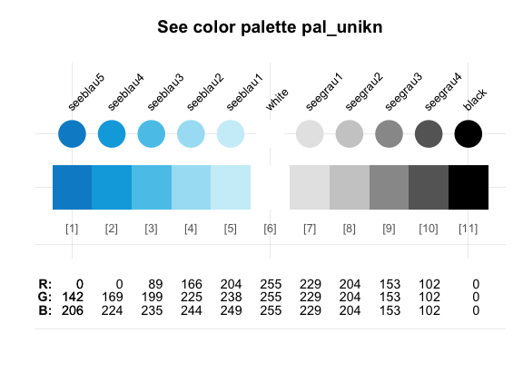

<!--  -->
-   A shorter version consisting of 10 colors is provided as `pal_unikn_web`.

-   An alternative color palette with 10 more muted colors (intended for PowerPoint presentations) is provided as `pal_unikn_ppt`.

Evaluating `seecol(pal = "unikn_basic")` shows these 3 basic unikn color palettes.

### All color palettes

Beyond the 3 variants of `pal_unikn`, the **unikn** package provides the following color palettes:

``` r
seecol("all")
```

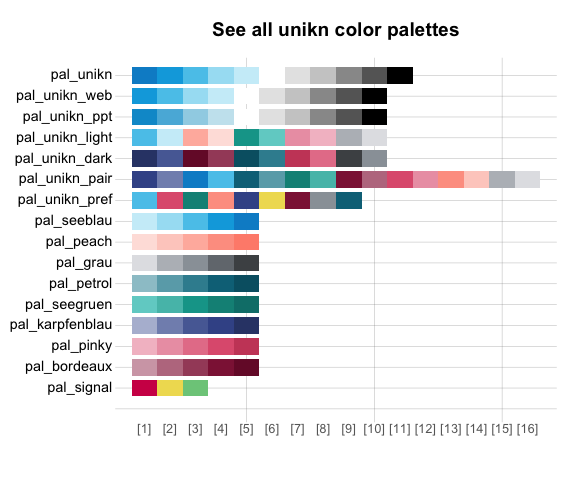

Specifically, the Excel file on [Colours for complex graphics](https://www.uni-konstanz.de/en/university/news-and-media/create-online-and-print-media/corporate-design/colours-for-complex-graphics/) defines 9 additional color palettes that are exported by **unikn** as the following named color palettes:

``` r
# Show 9 color gradient palettes:
seecol(pal = "grad_all")

# 8 mono-tone palettes: ----- 
# Name:          Nr:           Tone:          
pal_seeblau      # 5 shades of seeblau
pal_peach        # 5           peach
pal_grau         # 5           grau
pal_petrol       # 5           petrol
pal_seegruen     # 5           seegruen 
pal_karpfenblau  # 5           karpfenblau
pal_pinky        # 5           pink
pal_Bordeaux     # 5           Bordeaux

# 1 signal (Ampel) palette: ----- 
pal_signal       # 3           Ampel
```

Each color palette contains a preferred color.[1] All preferred colors are contained in a corresponding color palette `pal_unikn_pref`:

``` r
# Using preferred colors: ----- 
pal_unikn_pref             # color palette of preferred colors
pal_unikn_pref[1]          # preferred (named) color 1
pal_unikn_pref[[1]]        # color value 1: #59C7EB"
pal_unikn_pref["Seeblau"]  # preferred color by name
```

Additional pre-defined color palettes include:

``` r
# Plot additional color palettes: ----- 
seecol(pal_unikn_pref)   # palette of  9 preferred colors
seecol(pal_unikn_light)  # palette of  8 light colors (in 4 pairs)
seecol(pal_unikn_dark)   # palette of  8 dark colors (in 4 pairs)
seecol(pal_unikn_pair)   # palette of 16 paired colors (in 8 pairs)
```

More flexible and complex color palettes can be created by using the `seecol()` and `usecol()` functions.

Color-related functions
-----------------------

The `seecol()` and `usecol()` functions provide a convenient interface for *viewing* and *using* color palettes.

### Plotting color palettes

The `seecol()` function provides a quick overview over the contents of a color palette and allows comparisons between color palettes:

``` r
# Plot a color palette: ----- 
seecol(pal_unikn_pref)
```

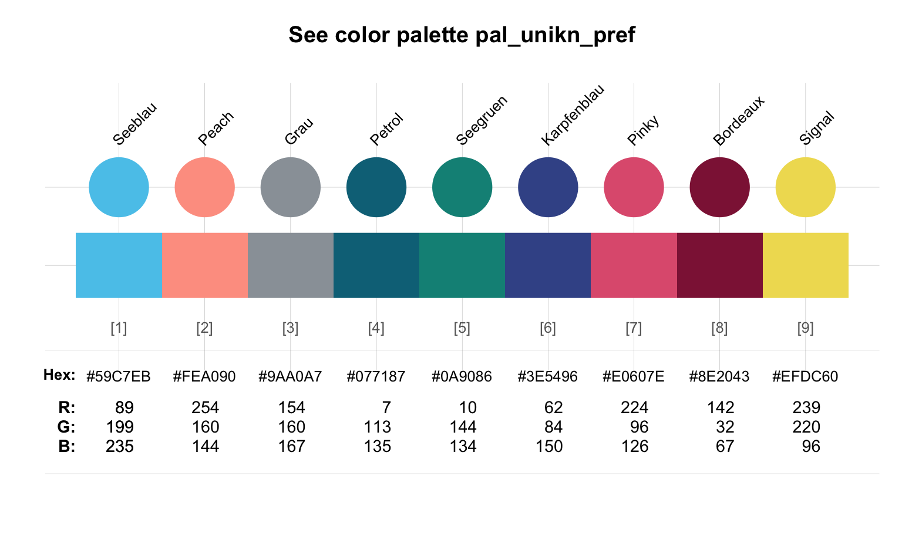

### Partial color palettes

When only a subset of a color palette are needed, the `seecol()` and `usecol()` functions provide a reasonable subset of a known color palette:

``` r
# From pal_unikn (default): ----- 
seecol(n = 4)
```

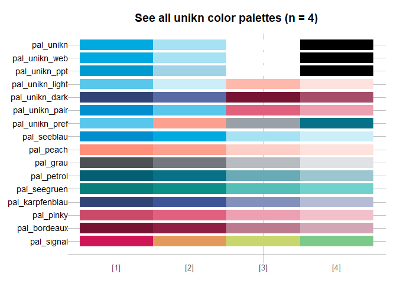

``` r

# From pal_seeblau: ----- 
seecol(pal_seeblau, n = 4)
```

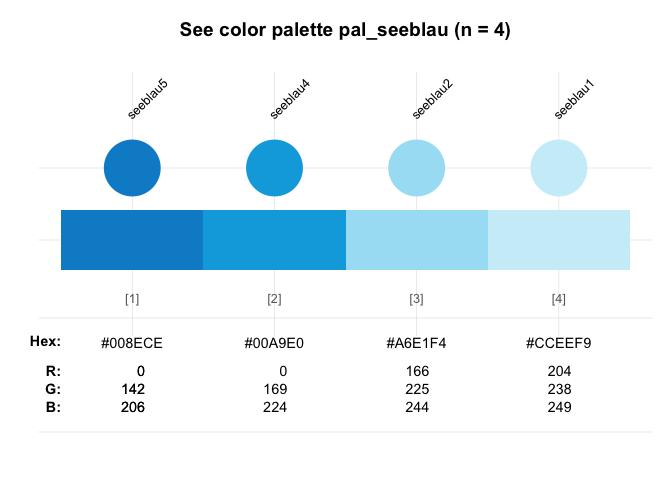

### Extending and creating color palettes

The `seecol` function provides color gradients based on given colors or color palettes. This serves 2 main functions:

1.  Extending existing color palettes (to arbitrary lengths):

``` r
# Extending color palettes: ----- 
seecol(pal_unikn, n = 21)  
```

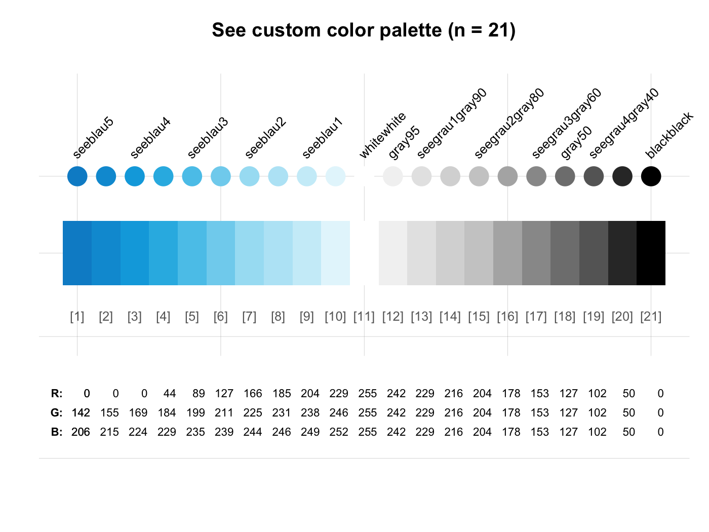

``` r
seecol(pal_seeblau, n = 8)
```

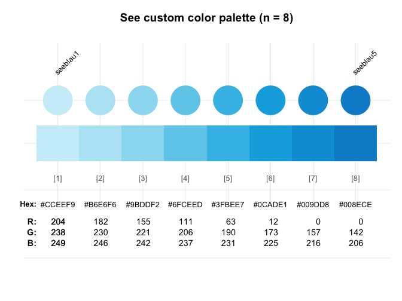

1.  Combining colors to create new color palettes:

New color palettes of arbitrary length can be created by combining colors (from **unikn** or base R) and the desired resolution of the color gradient (as an integer argument):

``` r
# Combining colors: ----- 
seecol(c(Seeblau, "white", Pinky), 11) 
```

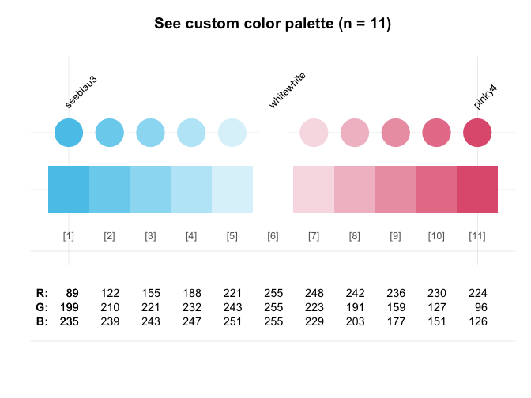

``` r
seecol(c(Karpfenblau, Seeblau, "gold"), 10) 
```

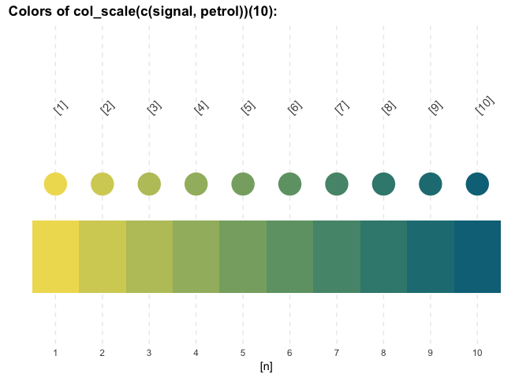

1.  Mixing and merging colors and color palettes to create new color palettes. For best results, consider combining existing color palettes and individual colors into new color palettes:

``` r
# Combining color palettes (and colors): ----- 
seecol(c(rev(pal_seeblau), "white", pal_peach), 11)
```


``` r
seecol(c(rev(pal_seeblau), "white", pal_pinky), 11)
```

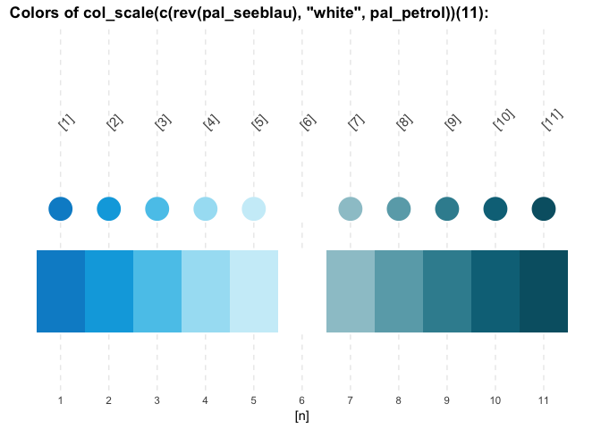

``` r
seecol(c(rev(pal_seeblau), "white", pal_seegruen), 11)
```

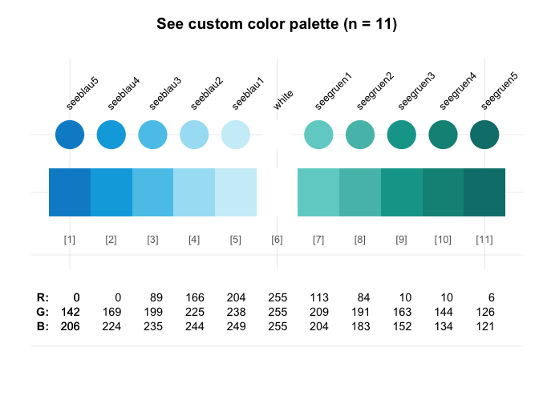

``` r
seecol(c(rev(pal_petrol),  "white", pal_bordeaux), 11)
```


Using color palettes
--------------------

The **unikn** package exports the color palettes shown by `seecol(pal = "all")` and the 9 preferred colors of `pal_unikn_pref` (e.g., `Seeblau`, `Seegruen`, etc.) as named colors.

The `usecol()` function provides convenient access and additional options for using them in graphs. Some examples for using

1.  Some examples of using **unikn** color palettes and functions in base R plots:

``` r
# (a) Using color palettes:
barplot(1/sqrt(1:11),  col = usecol(pal_unikn))
```

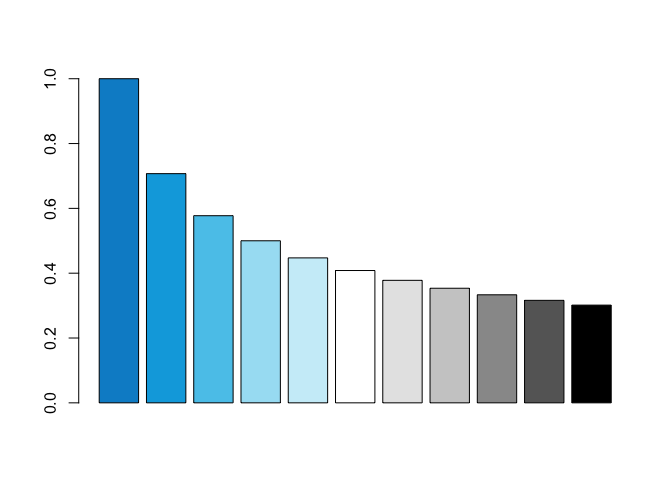

``` r
barplot(1/sqrt(10:25), col = usecol(pal_unikn_pair))
```

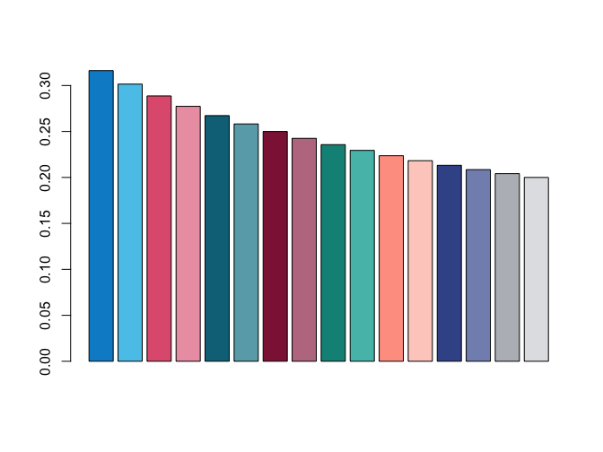

``` r
# (b) Using only n colors of a palette:
barplot(1/sqrt(1:5), col = usecol(pal_unikn, n = 5)) 
```

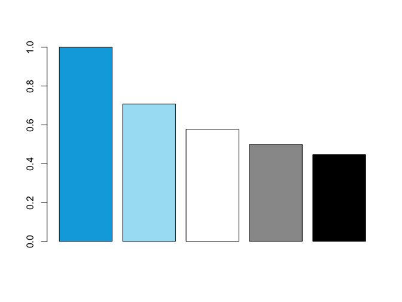

``` r
# (c) Scatterplots:
# plot(x = runif(200), y = runif(200), "p", pch = 16, cex = 5, col = adjustcolor(pal_unikn, alpha.f = 1))   # 0 transparency
plot(x = runif(200), y = runif(200), "p", pch = 16, cex = 5, col = adjustcolor(pal_unikn, alpha.f = .33)) # +transparency
```

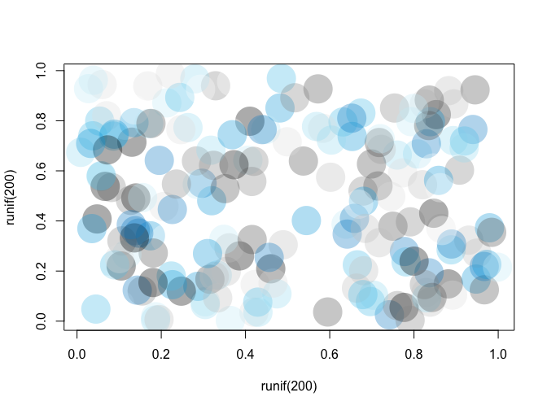

1.  Visualizing various **unikn** color palettes with `image`:

``` r
# Random images:
set.seed(1)
n <- 20
m <- matrix(rnorm(n*n), ncol = n, nrow = n)

image(m, col = seecol(pal_seeblau))  # seecol() shows & use colors 

image(m, col = usecol(pal_peach))    # usecol() only uses colors
image(m, col = usecol(pal_seegruen))
image(m, col = usecol(pal_petrol))
image(m, col = usecol(pal_bordeaux))
```

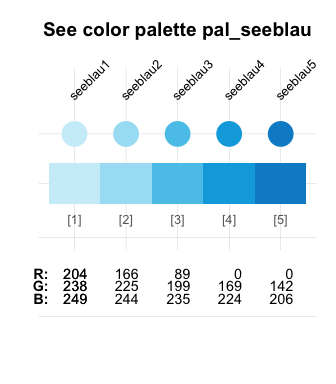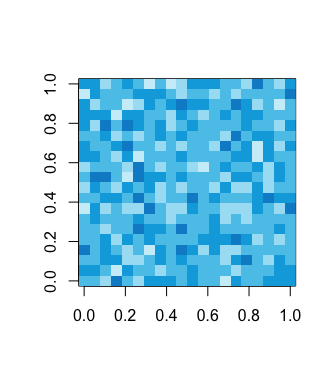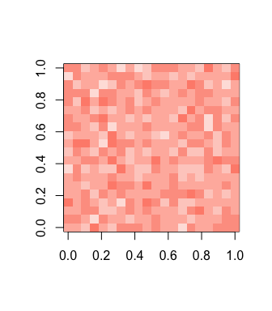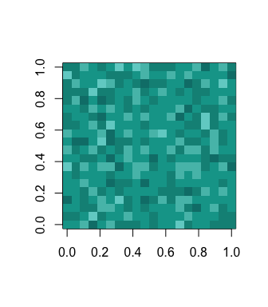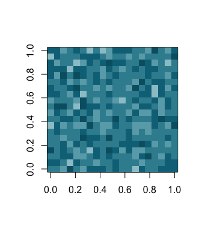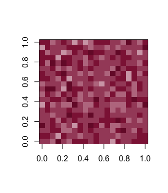

1.  More geometric images with `image`:

``` r
# (a) pal_seeblau and pal_seegruen:
x <- y <- seq(-4 * pi, 4 * pi, len = 15)
r <- sqrt(outer(x^2, y^2, "+"))
image(z = cos(r^2) * exp(-r/6), col = colorRampPalette(c(pal_seeblau, pal_seegruen))(10), 
      main = "Shades of Seeblau/Seegruen", axes = FALSE)
# contour(z, add = TRUE, drawlabels = FALSE)

# (b) pal_seeblau and pal_pinky:
x <- y <- seq(-4 * pi, 4 * pi, len = 75)
r <- sqrt(outer(x^2, y^2, "+"))
image(z = cos(r^2) * exp(-r/6), col = colorRampPalette(c(pal_seeblau, pal_pinky))(20), 
      main = "Shades of Seeblau/Pinky", axes = FALSE)
# contour(z, add = TRUE, drawlabels = FALSE)
```

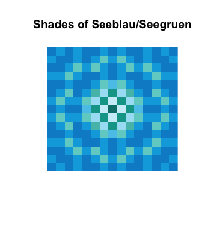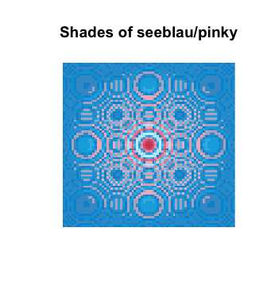

1.  Using **unikn** in `ggplot` calls (using **ggplot2**):

``` r
# Example based on https://www.r-graph-gallery.com/137-spring-shapes-data-art/ 

# (1) Create data: ---- 
ngroup <- 50
names <- paste("G_", seq(1, ngroup), sep = "")
df <- data.frame()

set.seed(3)
for(i in seq(1:30)){
    data = data.frame(matrix(0, ngroup, 3))
    data[, 1] = i
    data[, 2] = sample(names, nrow(data))
    data[, 3] = prop.table(sample( c(rep(0, 100), c(1:ngroup)), nrow(data)))
    df = rbind(df, data)}
colnames(df) <- c("X","group","Y")
df <- df[order(df$X, df$group) , ]

# (1) Choose colors: ---- 

# (a) using RColorBrewer: 
library(RColorBrewer)
cur_col <- brewer.pal(11, "Paired") 
cur_col <- colorRampPalette(cur_col)(ngroup)
cur_col <- cur_col[sample(c(1:length(cur_col)), size = length(cur_col))]  # randomize

# (b) using unikn:
library(unikn)
cur_col <- usecol(pal = pal_unikn, n = ngroup)
# cur_col <- cur_col[sample(c(1:length(cur_col)), size = length(cur_col))]  # randomize

# (3) Use ggplot2: ---- 
library(ggplot2)
ggplot(df, aes(x = X, y = Y, fill = group)) + 
  geom_area(alpha = 1, color = Grau, size = .01 ) +
  theme_bw() + 
  scale_fill_manual(values = cur_col) +
  theme_void() +
  theme(legend.position = "none")
```


Text decorations
----------------

**unikn** also provides some functions for plotting graphical elements (like boxes) and styled text (with decorations like colored backgrounds or underlining). By default, the text-decoration functions assume that you want to add styled text to an existing plot, unless the `new_plot` argument specifies a type of plot to be generated. As the use of these functions is explained in detail in `vignette("Text")`, we only provide some examples here:

### Mark

The `mark()` function allows emphasizing text by plotting it with colored background (to provide the functionality of "Markieren"):

``` r
mark(labels = c("Markieren", "ist ein Bestandteil", "von Studieren."), 
     x = 0, y = .8, y_layout = .03, cex = 1.5, new_plot = "slide")
```

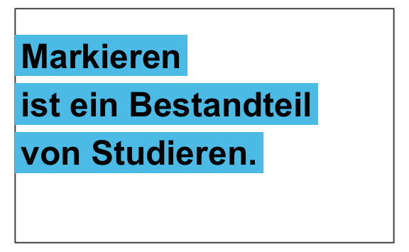

### Underline

The `uline()` function allows emphasizing text by plotting it with colored underlining (to provide the functionality of "Unterstreichen"):

``` r
uline(labels = c("Geradlinig", "Authentisch", "Beweglich", "Offen", "Paradiesisch"), 
      x = .05, y = .9, y_layout = "even", cex = 1.1, font = 2, new_plot = "slide")
```

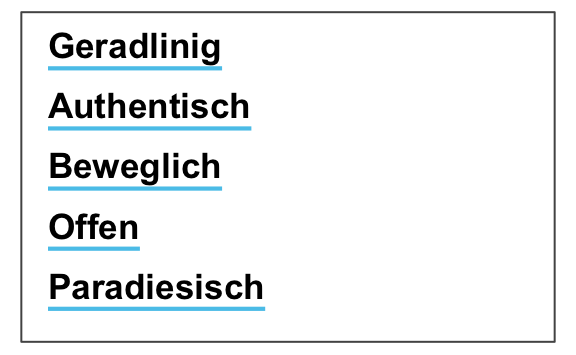

### Post

The `post()` function allows adding text to a rectangular `xbox` (to provide the functionality of "Merken"):

``` r
xbox(col = usecol(pal_seeblau[[5]]), dim = c(2, 2))
post(labels = c("Für eine", "Kultur der", "Kreativität"), x = .1, y = .8, cex = 1.5, font = 2)
```

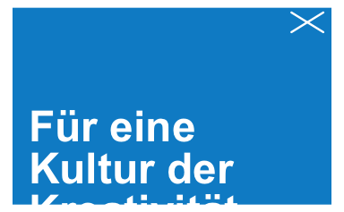

### Headings

The `heading()` function is a convenient wrapper around `mark`:

``` r
heading(labels = c("pa-", "ra-", "die-", "sisch"))
```

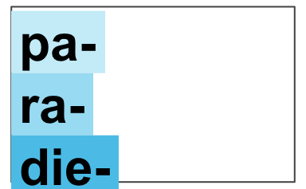

Headings violating the official recommendations (e.g., step-wise titles) will generate a message.

### URLs

Finally, the `url_unikn()` function allows formatting URLs the uni.kn way:

``` r
my_url <- url_unikn("https://www.uni-konstanz.de/")  # input URL as copied from web browser

post(labels = my_url, x = .2, y = .1, font = 4, new_plot = "xbox")
```

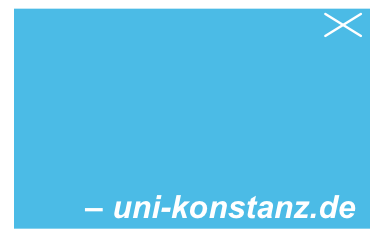

### Caveats

Please note the following caveats:

-   Plotting text (i.e., graphically rendering characters) is rarely a good idea. It typically doesn't scale (when changing the size of images) and cannot be recognized automatically (e.g., copied, indexed, or scraped). Hence, the following functions should only be used in contexts in which no better solutions are available or practical (e.g., when specifically creating images, or needing to add text to graphs).

-   Like all other templates, our renderings are subject to constraints and limitations. As a standard installation of R lacks the official "Theinhardt" fonts, we can only mimic the design specifications (in Arial, sans serif). Nevertheless, the **unikn** package helps preventing common mistakes by novices (e.g., boxes or lines extending beyond text, or step-functions in multi-line titles) and can be customized and improved by expert users.

Overall, we hope that the following functions will be useful for plotting graphical elements (e.g., boxes, logos, etc.) and achieving a uniform look when styling visualizations.

ToDo
----


The **unikn** package is work in progress. We are still working on:

-   Graphical themes for **ggplot2** that use **unikn** color palettes and text elements

-   Additional templates for images and slides

Copyrights
----------

The [University of Konstanz’s Corporate Design](https://www.uni-konstanz.de/en/university/news-and-media/create-online-and-print-media/corporate-design/the-university-of-konstanzs-corporate-design/) (CD) was created by the [University of Konstanz](http://www.uni-konstanz.de) and [Strichpunkt GmbH](https://www.strichpunkt-design.de/) and introduced in 2014. While we are affiliated with the [University of Konstanz](http://www.uni-konstanz.de) and make some graphical elements available to R users (e.g., for creating scientific visualizations), all CD copyrights remain with the original copyright holders.

We strive for an authentic representation of a highly-specified corporate design. While rigid specifications help to maintain coherence and consistency, they also cause frustration in expert users. As the design has been developed in a flexible way that allows for individual elements to be modified as needed, we enable some liberties, mostly by imposing fewer restrictions. Examples include:

-   allowing finer color gradients and flexible combinations of color palettes (via `col_scale`);
-   providing a designated `signal` color (from `pal_signal`);
-   using the spelling "color" (rather than "colour") throughout the **unikn** package.

License
-------

<!-- unikn pkg logo and link: -->
<a href = "https://github.com/hneth/unikn/">  </a>

<!-- License: CC BY-SA 4.0 (also in Description) -->
<!-- Image with link: -->
<a rel="license" href="http://creativecommons.org/licenses/by-sa/4.0/"></a>

<!-- Text with links: -->
<span xmlns:dct="http://purl.org/dc/terms/" property="dct:title"><strong>unikn</strong></span> by <a xmlns:cc="http://creativecommons.org/ns#" href="https://github.com/hneth/unikn" property="cc:attributionName" rel="cc:attributionURL">Hansjörg Neth and Nico Gradwohl</a> is licensed under a <a rel="license" href="http://creativecommons.org/licenses/by-sa/4.0/">Creative Commons Attribution-ShareAlike 4.0 International License</a>. (Based on a work at <a xmlns:dct="http://purl.org/dc/terms/" href="https://github.com/hneth/unikn" rel="dct:source">https://github.com/hneth/unikn</a>).

References
----------

The copyrights to all designs remain with their original creators:

-   Universität Konstanz, © 2015, Version 1.6, 21. September 2015, [‒ uni-konstanz.de](https://www.uni-konstanz.de/)

-   Strichpunkt GmbH, [‒ strichpunkt-design.de](https://www.strichpunkt-design.de/)

Color definitions are based on the following sources:

-   [Corporate design at uni.kn](https://www.uni-konstanz.de/universitaet/aktuelles-und-medien/online-und-print-medien-gestalten/corporate-design/das-cd-der-universitaet-konstanz/)

-   [Corporate design manual (PDF)](https://www.uni-konstanz.de/typo3temp/secure_downloads/57014/0/0143c03b80bd1fa99843c8f8686f806305928078/UKN_CD_Manual_150921.pdf)

-   [Colours for complex graphics (xls)](https://www.uni-konstanz.de/en/university/news-and-media/create-online-and-print-media/corporate-design/colours-for-complex-graphics/)

<!-- Update: -->
\[Updated on 2019-05-20.\]

<!-- eof. -->

[1] Whereas the official definition does not identify a preferred color for the Ampel color palette (`pal_signal`), we provide its alert color (i.e., `pal_signal[2]`) as a designated color `signal`.
