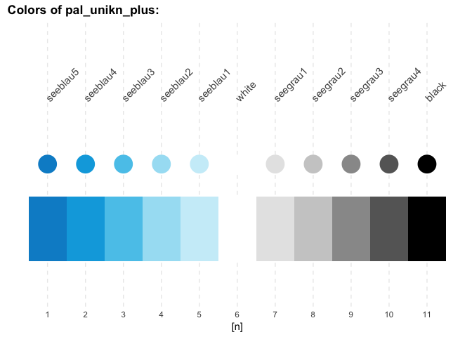
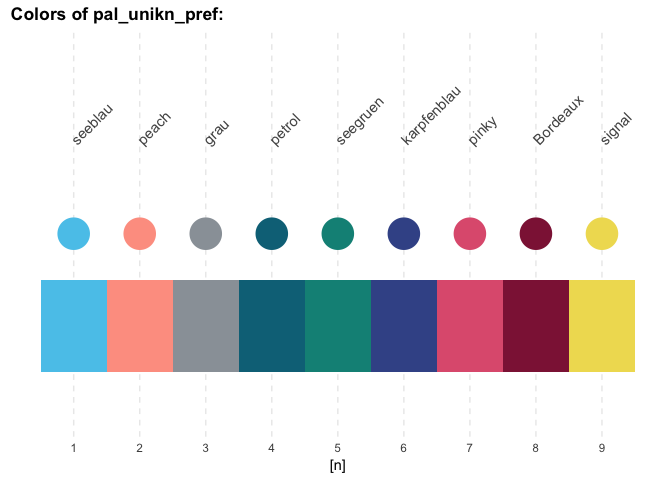
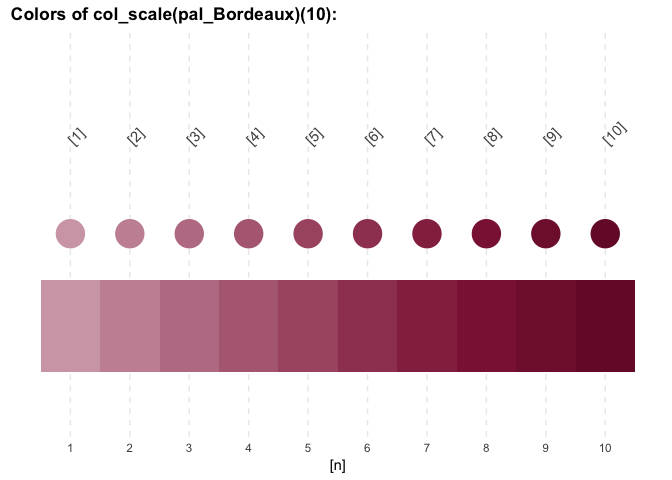
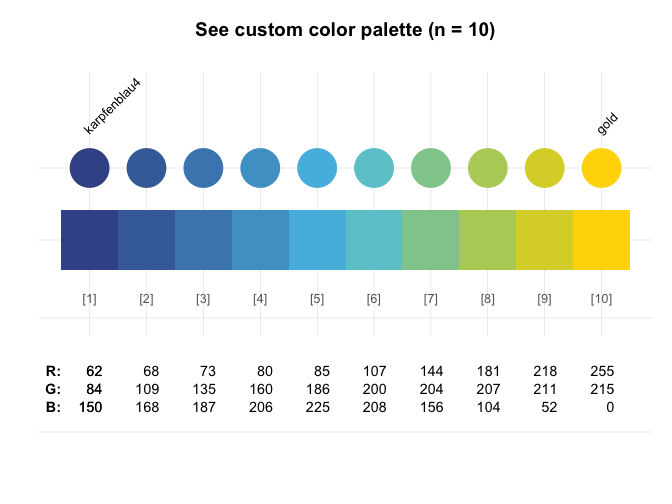
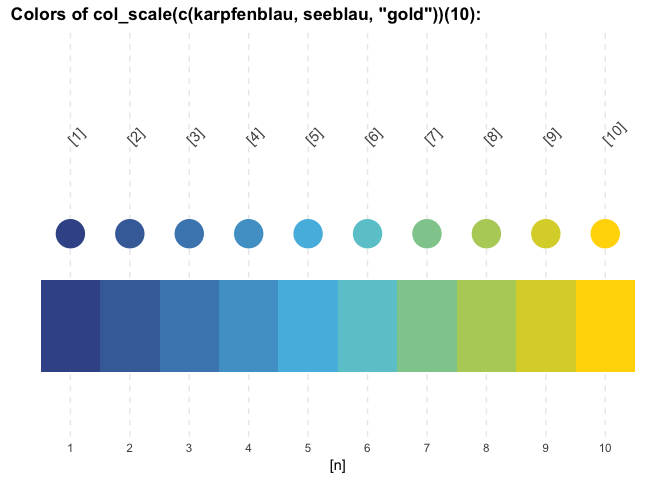
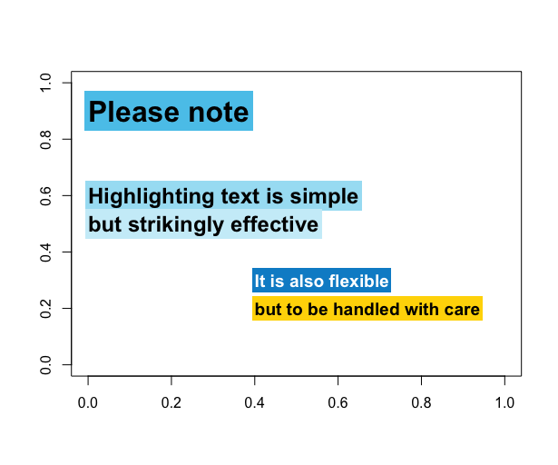
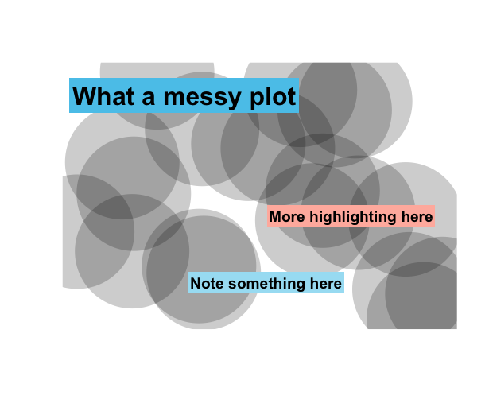
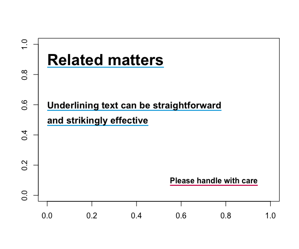
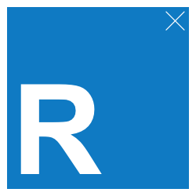

<!-- README.md is generated from README.Rmd. Please edit THIS (Rmd) file. -->
unikn
=====

<!-- unikn pkg logo and link: -->
<a href = "https://github.com/hneth/unikn/">  </a>

The `unikn` package enables the use some elements of the [University of Konstanz](https://www.uni-konstanz.de/)'s corporate design for users of [R](https://www.r-project.org/). For instance, it provides a range of beautiful color palettes for scientific visualizations that are consistent with [corporate design specifications](https://www.uni-konstanz.de/en/university/news-and-media/create-online-and-print-media/corporate-design/colours-for-complex-graphics/).

Motivation
----------

<!-- uni.kn logo and link: -->
<!--  -->
<a href = "https://www.uni.kn/">  </a>

<!-- unikn CD: -->
In 2014, the [University of Konstanz](https://www.uni-konstanz.de/) introduced a highly recognizable corporate design. Its key component is the consistent use of a `seeblau` color and a corresponding color palette that blends various shades of `seeblau` (in boxes, lines, and other graphical elements) with text (in black-and-white). (See the official [brand information](https://www.uni-konstanz.de/en/university/news-and-media/create-online-and-print-media/corporate-design/) and the [Corporate Design Manual (pdf)](https://www.uni-konstanz.de/typo3temp/secure_downloads/57014/0/0143c03b80bd1fa99843c8f8686f806305928078/UKN_CD_Manual_150921.pdf) for details.)

<!-- Goals of the unikn pgk: -->
The `unikn` package aims to facilitate the use of some design elements for users of [R](https://www.r-project.org/). While the correct use of default specifications should be simple and straightforward, we also allow some flexibility for expert users (e.g., for creators of scientific visualizations).

<!-- Overview: -->
The package currently provides 4 types of objects or functions:

1.  Colors, color palettes, and related functions
2.  Plotting styled graphical objects (e.g., boxes and frames)
3.  Plotting styled text elements (e.g., highlighting and underlining)
4.  Graphical support (e.g., commands and themes for creating scientific visualizations)

Additional elements are added as they become available. Please use responsibly!

Installation
------------

The current development version can be installed from its [GitHub](https://github.com) repository at <https://github.com/hneth/unikn/>:

``` r
# install.packages('devtools')
devtools::install_github('hneth/unikn')

library(unikn)  # load the package
```

Colors
------

A distinctive and recognizable color scheme is the most obvious element of the [University of Konstanz](https://www.uni-konstanz.de/)'s corporate design.

### Basic color palettes

Basic color palettes are specified according to the **Corporate Design Manual** [(pdf)](https://www.uni-konstanz.de/typo3temp/secure_downloads/57014/0/0143c03b80bd1fa99843c8f8686f806305928078/UKN_CD_Manual_150921.pdf):

-   Primary and default color palette (`pal_unikn`):

``` r
# Default color palette: ----- 
pal_unikn  # 10 default colors (web/sRGB)

# Plot color palette: ----- 
plot_pal(pal_unikn)
seecol(pal_unikn)
```


-   Secondary color palette (`pal_unikn_ppt`): An alternative color palette with more muted colors (intended for PowerPoint presentations) is provided as `pal_unikn_ppt`.

### Extension

Adding the darkest seeblau color (from `pal_seeblau[5]`) to the front of `pal_unikn` places `white` into the middle of a symmetrical color palette `pal_unikn_plus` (with 11 colors):

``` r
# Extended unikn color palette: ----- 
pal_unikn_plus  # 11 colors (white in middle)

# Plot color palette: ----- 
plot_pal(pal_unikn_plus)
seecol(pal_unikn_plus)
```



### Additional color palettes

The following dedicated color palettes are defined in an Excel file on [Colours for complex graphics](https://www.uni-konstanz.de/en/university/news-and-media/create-online-and-print-media/corporate-design/colours-for-complex-graphics/) and provided here by the following color palettes:

``` r
# All palettes:
seecol("all")

# 8 mono-tone palettes: ----- 
# Name:          Nr:           Tone:          
pal_seeblau      # 5 shades of seeblau
pal_peach        # 5           peach
pal_grau         # 5           grau
pal_petrol       # 5           petrol
pal_seegruen     # 5           seegruen 
pal_karpfenblau  # 5           karpfenblau
pal_pinky        # 5           pink
pal_Bordeaux     # 5           Bordeaux

# 1 signal (Ampel) palette: ----- 
pal_signal       # 3           Ampel
```

Each color palette contains a preferred color.[1] All preferred colors are contained in a corresponding color palette `pal_unikn_pref`:

``` r
# Using preferred colors: ----- 
pal_unikn_pref             # color palette of preferred colors
pal_unikn_pref[1]          # preferred (named) color 1
pal_unikn_pref[[1]]        # color value 1: #59C7EB"
pal_unikn_pref["seeblau"]  # preferred color by name
```

Additional pre-defined color palettes include:

``` r
# Plot additional color palettes: ----- 
seecol(pal_unikn_pref)   # palette of  9 preferred colors
seecol(pal_unikn_light)  # palette of  8 light colors (in 4 pairs)
seecol(pal_unikn_dark)   # palette of  8 dark colors (in 4 pairs)
seecol(pal_unikn_pair)   # palette of 16 paired colors (in 8 pairs)
```

More flexible and complex color palettes can be created by using the `col_scale()` function.

Color-related functions
-----------------------

### Plotting color palettes

The `plot_pal()` function provides a quick overview over the contents of a color palette and allows comparisons between color palettes:

``` r
# Plot a color palette: ----- 
seecol(pal_unikn_pref)
# plot_pal(pal_unikn_pref)  # OLDER
```



### Partial color palettes

When only a subset of a color palette are needed, the `use_pal_n()` function provides a reasonable subset of a known color palette:

``` r
# From pal_unikn (default): ----- 
use_pal_n(n = 2)
use_pal_n(n = 4)

# From pal_seeblau: ----- 
use_pal_n(n = 1, pal = pal_seeblau)
use_pal_n(n = 4, pal = pal_seeblau)
```

### Extending and creating color palettes

The `mi()` function provides color gradients based on given colors or color palettes. This serves 2 main functions:

1.  Extending existing color palettes (to arbitrary lengths):

``` r
# Extending color palettes: ----- 
seecol(mixcol(n = 20))  
seecol(mixcol(pal_seeblau, 10))
seecol(mixcol(pal_bordeaux, 10))
```




1.  Combining colors to create new color palettes:

New color palettes of arbitrary length can be created by combining colors (from `unikn` or base R) and the desired resolution of the color gradient (as an integer argument):

``` r
# Combining colors: ----- 
plot_pal(col_scale(c(Seeblau, "white", Pinky))(10)) 
plot_pal(col_scale(c(Signal, Petrol))(10))  
plot_pal(col_scale(c(Bordeaux, "white", Petrol))(10)) 
plot_pal(col_scale(c(Karpfenblau, Seeblau, "gold"))(10)) 
```






For best results, consider combining existing color palettes and individual colors into new color palettes:

``` r
# Combining color palettes (and colors): ----- 
plot_pal(col_scale(c(rev(pal_seeblau), "white", pal_peach))(11))
plot_pal(col_scale(c(rev(pal_seeblau), "white", pal_pinky))(11))
plot_pal(col_scale(c(rev(pal_seeblau), "white", pal_petrol))(11))
plot_pal(col_scale(c(rev(pal_seeblau), "white", pal_seegruen))(11))
plot_pal(col_scale(c(rev(pal_petrol),  "white", pal_Bordeaux))(11))
```


Using color palettes
--------------------

Using color palettes (currently) requires using `unlist` or calling another function:

``` r
is.list(pal_unikn)  # TRUE
typeof(pal_unikn)   # "list"

unlist(pal_unikn)  # returns a named vector
typeof(unlist(pal_unikn)) # "character"

unlist(pal_unikn)["seeblau3"]  # call by name
unlist(pal_unikn)[2]  # call by index

barplot(rep(6:3, 4), col = colorRampPalette(pal_unikn_plus)(7))
```

### ToDo 

1.  Create a main `seecol` function that operates on all color palettes and provides the following functionality:

-   plot an overview over all available color palettes (like `display.brewer.all`);
-   plot detailed info on any specific (or a random) color palette (like `plot_pal`);
-   return `n` dedicated colors of a specific palette (like `pal_n`);
-   allows extending or combining colors and color palettes (like `col_scale`);
-   allows adding transparency, etc. (like `piratepal`).

1.  Provide more convenient color objects:

-   provide preferred colors (e.g., `Seeblau`, `Peach`) as atomic named vectors (of type character), to be referrable by name and number).
-   provide all color palettes as named vectors (rather than lists): `seeblau`, `peach`, etc.

### Demos

Examples for using color palettes in graphs:

``` r
# Using color palettes:
barplot(1/sqrt(1:11),  col = seecol(pal_unikn_plus))
barplot(1/sqrt(10:25), col = seecol(pal_unikn_pair))

# Using n colors of a palette:
barplot(1/sqrt(1:5), col = seecol(pal_unikn, n = 5)) 

# Scatterplot:
plot(x = runif(200), y = runif(200), "p", pch = 16, cex = 5, col = adjustcolor(pal_unikn, alpha.f = 1))   # 0 transparency
plot(x = runif(200), y = runif(200), "p", pch = 16, cex = 5, col = adjustcolor(pal_unikn, alpha.f = .33)) # +transparency
```

Visualizing data with `image`:

``` r
# Random images:
set.seed(1)
n <- 20
m <- matrix(rnorm(n*n), ncol = n, nrow = n)
image(m, col = seecol(pal_seeblau))
image(m, col = seecol(pal_peach))
image(m, col = seecol(pal_seegruen))
image(m, col = seecol(pal_petrol))
image(m, col = seecol(pal_pinky))
image(m, col = seecol(pal_bordeaux))

# Geometric images:
x <- y <- seq(-4 * pi, 4 * pi, len = 30)
r <- sqrt(outer(x^2, y^2, "+"))
z <- cos(r^2) * exp(-r/6)
image(z,, col = gray((0:32)/32))
image(z, axes = FALSE, main = "Math is hot...", xlab = expression(cos(r^2) * e^{-r/6}))

# pal_seeblau:
x <- y <- seq(-4 * pi, 4 * pi, len = 15)
r <- sqrt(outer(x^2, y^2, "+"))
image(z = cos(r^2) * exp(-r/6), col = colorRampPalette(c(pal_seeblau, pal_seegruen))(10), main = "Shades of seeblau/seegruen", axes = FALSE)
# contour(z, add = TRUE, drawlabels = FALSE)

x <- y <- seq(-4 * pi, 4 * pi, len = 75)
r <- sqrt(outer(x^2, y^2, "+"))
image(z = cos(r^2) * exp(-r/6), col = colorRampPalette(c(pal_seeblau, pal_pinky))(20), main = "Shades of seeblau/pinky", axes = FALSE)
# contour(z, add = TRUE, drawlabels = FALSE)
```

Text
----

`unikn` also provides some functions for plotting graphical elements (like boxes) and styled text (with decorations like colored backgrounds or underlining).

Some important caveats:

-   Plotting text (i.e., graphically rendering characters) is rarely a good idea. It typically doesn't scale (when changing the size of images) and cannot be recognized automatically (e.g., copied, indexed, or scraped). Hence, the following functions should only be used in contexts in which no better solutions are available or practical (e.g., when specifically creating images, or needing to add text to graphs).

-   Like all other templates, our renderings are subject to constraints and limitations. As a standard installation of R lacks the official "Theinhardt" fonts, we can only mimic the design specifications (in Arial, sans serif). Nevertheless, the `unikn` package helps preventing common mistakes by novices (e.g., boxes or lines extending beyond text, or step-functions in multi-line titles) and can be customized and improved by expert users.

Overall, we hope that the following functions will be useful for plotting graphical elements (e.g., boxes, logos, etc.) and achieving a uniform look when styling visualizations.

### ToDo 

Identify key functions:

-   `mark` (Markieren)
-   `line` (Anstreichen)
-   `post` (Merken)

For `mark` and `line`: Versions that allow to arrange multiple character strings with fixed spacing and sensible default colors:

-   `heading` for arranging headings (sensible defaults, warn in case of step functions)

<!-- Demo of text functions: -->
``` r
post(labels = c("Bitte beachten:", "Dies hier ist wichtig."), y = c(.5, .4), cex = c(1.5, 1.2), font = c(2, 1))
mark(labels = c("Markieren", "geht über Studieren."), y_layout = .05, col_bg = c(Seeblau, Peach), new_plot = "slide")
line(labels = c("Ewig", "währt", "am längsten"), y = .8, y_layout = .1, font = 2, new_plot = "blank")
heading(labels = c("Studieren", "ist Theorie und Praxis", "und Probieren"))
```

Post: Generating logo

``` r
# unikn: 
post(labels = "unikn::", cex = 2.5, font = 2, y = .4)  # save in size: 250 x 250 pixel

# R: 
post(labels = "R", col_bg = pal_seeblau[[5]], 
     cex = 10, font = 2, y = .33)  # save in size: 250 x 250 pixel

# ToDo: 
post(labels = "ToDo", col_bg = pal_signal[[1]], 
     cex = 3.5, font = 2, y = .35)  # save in size: 250 x 250 pixel
post(labels = "ToDo", col_bg = pal_petrol[[4]], 
     cex = 3.5, font = 2, y = .35)  # save in size: 250 x 250 pixel
post(labels = "ToDo", col_bg = pal_pinky[[4]], 
     cex = 3.5, font = 2, y = .35)  # save in size: 250 x 250 pixel
post(labels = "ToDo", col_bg = pal_seegruen[[4]], 
     cex = 3.5, font = 2, y = .35)  # save in size: 250 x 250 pixel
```

### Examples

Key text functions include:

-   Highlighting text with `mark`:

 

-   Underlining text with `line`:



-   Boxing text with `post`:

  

### Image sizes

Note that text is rendered graphically and does not scale when merely re-sizing bitmap images. Hence, to preserve the look of the original plots, plots should be generated and viewed in the desired size (in R) and displayed without further scaling (in other media):[2]

For instance, the following image was generated and saved as an image with 250 x 250 pixels. If displayed in this size, it looks crisp and clear:


Using a smaller image size can still work, as long as fonts remain legible:


However, using a larger image size shows a clear loss of image quality:


Graphical themes
----------------

-   `ggplot` theme (using `unikn` color palettes and text elements)

Copyrights
----------

The [University of Konstanz’s Corporate Design](https://www.uni-konstanz.de/en/university/news-and-media/create-online-and-print-media/corporate-design/the-university-of-konstanzs-corporate-design/) was created by the [University of Konstanz](http://www.uni-konstanz.de) and [Strichpunkt GmbH](https://www.strichpunkt-design.de/) and introduced in 2014. While we make some graphical elements available to R users (e.g., for creating scientific visualizations), all copyrights remain with the original copyright holders.

We strive for an authentic representation of a highly-specified corporate design. While rigid specifications help to maintain coherence and consistency, they also cause frustration in expert users. As the design has been developed in a flexible way that allows for individual elements to be modified as needed, we enable some liberties, mostly by imposing fewer restrictions. Examples include:

-   allowing finer color gradients and flexible combinations of color palettes (via `col_scale`);
-   providing a designated `signal` color (from `pal_signal`);
-   using the spelling "color" (rather than "colour") throughout the `unikn` package.

References
----------

The copyrights to all design elements remain with their original creators:

-   Universität Konstanz, © 2015, Version 1.6, 21. September 2015, [-uni-konstanz.de](https://www.uni-konstanz.de)

-   Strichpunkt GmbH, [-strichpunkt-design.de](https://www.strichpunkt-design.de/)

Color definitions are based on the following sources:

-   [Corporate Design Manual (pdf)](https://www.uni-konstanz.de/typo3temp/secure_downloads/57014/0/0143c03b80bd1fa99843c8f8686f806305928078/UKN_CD_Manual_150921.pdf)

-   [Colours for complex graphics (xls)](https://www.uni-konstanz.de/en/university/news-and-media/create-online-and-print-media/corporate-design/colours-for-complex-graphics/)

<!-- Update: -->
\[Updated 2019-03-23 by [hn](https://neth.de).\]

<!-- eof. -->

[1] Whereas the official definition does not identify a preferred color for the Ampel color palette (`pal_signal`), we provide its alert color (i.e., `pal_signal[2]`) as a designated color `signal`.

[2] Depending on the designated output format, scaling down (to smaller image sizes) is possible, whereas scaling up (to larger image sizes) typically causes loss of image quality.
