<!-- README.md is generated from README.Rmd. Please edit THIS (Rmd) file. -->
<!-- Devel badges start: -->
<!-- [](https://CRAN.R-project.org/package=unikn) -->
<!-- [](https://github.com/hneth/unikn/actions/workflows/check-standard.yaml) -->
<!-- [](https://www.r-pkg.org/pkg/unikn) -->
<!-- [](https://www.r-pkg.org/pkg/unikn)  -->
<!-- [](https://doi.org/10.5281/zenodo.7096191) -->
<!-- Devel badges end. -->
<!-- Release badges start: -->

[](https://CRAN.R-project.org/package=unikn)
[](https://www.r-pkg.org/pkg/unikn)
[](https://doi.org/10.5281/zenodo.7096191)
<!-- Release badges end. -->

<!-- ALL status badges: 
[](https://CRAN.R-project.org/package=unikn) 
[](https://github.com/hneth/unikn/actions/workflows/check-standard.yaml) 
[](https://travis-ci.org/hneth/unikn/)
[](https://www.r-pkg.org/pkg/unikn)
[](https://www.r-pkg.org/pkg/unikn)
[](https://www.rdocumentation.org/packages/unikn/)
-->

# unikn 1.0.0 

<!-- unikn pkg logo and link: -->
<!-- <a href = "https://CRAN.R-project.org/package=unikn">

</a> 
-->
<!-- Slogan: -->

### Enabling corporate design elements in R

<!-- The **unikn** package enables corporate design elements in\ R. It... -->

The **unikn** package provides useful color functionality — by defining
dedicated colors and color palettes, and functions for finding,
changing, viewing, and using them — and styled text elements (e.g., for
marking, underlining, or plotting colored titles)
in [R](https://www.r-project.org/). The package’s pre-defined range of
colors and text decoration functions is based on the corporate design of
the [University of Konstanz](https://www.uni-konstanz.de/) (see
[link](https://www.uni-konstanz.de/en/university/news-and-media/create-online-and-print-media/corporate-design/)
for details), but can easily be adapted and extended to other purposes
or institutions.

### Overview

<!-- Motivation    -->

Many institutions devise and impose corporate designs (CDs) for creating
and maintaining a consistent impression in presentations and
publications. Even when writing an article or thesis, it usually makes
sense to define some graphical elements (e.g., a color scheme) and use
them consistently throughout a project.

<!-- Contents/goals of the unikn pgk: -->

The **unikn** package facilitates the use of corporate design elements
for R users. It currently contains dedicated **colors** and **color
palettes** of the [University of
Konstanz](https://www.uni-konstanz.de/), plus many additional color
palettes from other institutions. In addition, **unikn** provides a
range of **color functions** that make it easy to define, modify, find,
and use colors in R. While this renders the use of default
specifications simple and straightforward, experienced users can apply
the tools in a flexible and creative fashion (e.g., for designing new
color palettes and using them in scientific visualizations).

<!-- Overview: -->

The **unikn** package currently provides five types of objects and
functions:

1.  Pre-defined **colors** and **color palettes** (e.g., `Seeblau` and
    `pal_unikn`);

2.  Functions for **viewing and comparing colors** (`seecol()`), for
    **using or changing color palettes** (`usecol()`), and for
    **demonstrating color palettes** (`demopal()`);  

3.  Functions for **creating new color palettes** (`newpal()`), for
    **finding similar colors** (`simcol()`), and for **searching color
    names** (`grepal()`);

4.  Functions for **plotting graphical objects** (e.g., boxes and
    frames);  

5.  Functions for **plotting styled text** elements (e.g., highlighting
    and underlining text).  
    <!-- 6. Graphical support (e.g., commands and themes for creating scientific visualizations). -->

Essentially, the **unikn** package began by defining some colors, but
has now grown into a toolbox for addressing color- and plotting-related
tasks in R. As we had fun creating it, we hope that you enjoy using it
as well!

### Installation

The latest release of **unikn** is available from
[CRAN](https://CRAN.R-project.org/) at
<https://CRAN.R-project.org/package=unikn>:

``` r
install.packages('unikn')  # install from CRAN client
library('unikn')           # load the package
```

The current development version can be installed from its
[GitHub](https://github.com) repository at
<https://github.com/hneth/unikn/>:

``` r
# install.packages('devtools')  # install pkg
devtools::install_github('hneth/unikn')
```

## Colors and color palettes

The colors of **unikn** belong to two categories of color palettes:

- 16 palettes implementing the colors of the [University of
  Konstanz](https://www.uni-konstanz.de/)’s corporate design

- over 230 color palettes of more than 100 additional institutions are
  now provided by the
  **[unicol](https://CRAN.R-project.org/package=unicol)** package

### The colors of Konstanz University

Originally, the **unikn** package primarily provided the 16 color
palettes of the [University of Konstanz](https://www.uni-konstanz.de/):

``` r
seecol("all_unikn")
```

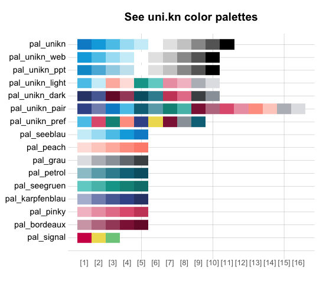

In 2014, the [University of Konstanz](https://www.uni-konstanz.de/)
introduced a highly recognizable CD. Its key component is the ubiquitous
use of a `Seeblau` color and a corresponding color palette that blends
various shades of `Seeblau` (in boxes, lines, and other graphical
elements) with text (in black-and-white).

#### Basic color palette

The default **unikn** color palette `pal_unikn` combines shades of
`pal_seeblau` and `pal_grau` with the base R colors “white” and “black”
into a diverging, symmetrical palette (of 11 colors):

``` r
seecol(pal_unikn)
```

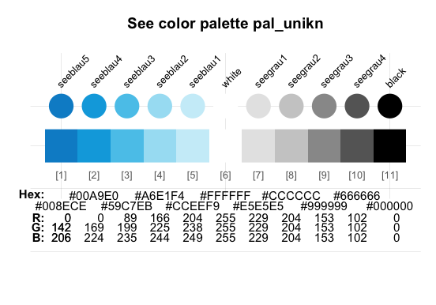

A shorter version (with 10 colors) and an alternative (with more muted
colors for PowerPoint presentations) are provided as `pal_unikn_web`
and `pal_unikn_ppt`, respectively. (Inspect `seecol("unikn_basic")` or
see the [corporate
design](https://www.uni-konstanz.de/en/university/news-and-media/create-online-and-print-media/corporate-design/)
specifications for details.)

<!-- Details: Basic color palette -->
<!-- The default color palette `pal_unikn` combines:   -->
<!-- - 5\ shades of `pal_seeblau` (reversed, i.e., from darker to lighter);   -->
<!-- - the base R color `"white"` (as the center color);   -->
<!-- - 4\ shades of grey (`pal_grau[1:4]`);   -->
<!-- - the base R color `"black"` (as the last color).    -->
<!-- This yields a diverging, symmetrical default color palette `pal_unikn` consisting of 11\ colors:  -->
<!--  -->
<!-- - A shorter version consisting of 10\ colors is provided as\ `pal_unikn_web`.  -->
<!-- - An alternative color palette with 10\ more muted colors (intended for PowerPoint presentations) is provided as\ `pal_unikn_ppt`.  -->
<!-- Evaluating `seecol(pal = "unikn_basic")` shows these three basic unikn color palettes.  -->

#### Special color palettes

Several more specialized color palettes combine the elements of nine
color hues. The preferred colors are contained in
palette `pal_unikn_pref`:

``` r
seecol(pal_unikn_pref)
```

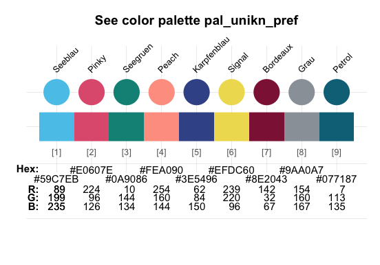

Each distinct hue is exported as a named color (e.g., `Pinky`) and a
corresponding gradient color palette (e.g., `pal_pinky`). (Inspect
`seecol("grad_all")` or the Excel file [Colours for complex
graphics](https://www.uni-konstanz.de/en/university/news-and-media/create-online-and-print-media/corporate-design/)
for details.)

**unikn** exports these color palettes as data frames that can be
accessed by number, value, or name:

``` r
# Accessing colors from palettes:
pal_unikn              # color palette of 11 colors
pal_unikn[3]           # preferred (named) color 3
pal_unikn[[3]]         # color value 3: #59C7EB"
pal_unikn["seeblau3"]  # color by name
```

<!-- #### Details {-} -->
<!-- Overall, the colors of the [University of Konstanz](https://www.uni-konstanz.de/) make up 16\ dedicated palettes, plus nine individual colors of `pal_unikn_pref` (e.g., `Seeblau`, `Seegruen`, etc.) as named colors. For details on each named color hue, evaluate `seecol()` on the following color palettes:  -->
<!-- Each color palette contains a preferred color.[^1]  -->
<!-- [^1]: Whereas the official definition does not identify a preferred color for the Ampel color palette (`pal_signal`),  -->
<!-- we provide its alert color (i.e., `pal_signal[2]`) as a designated color\ `Signal`.  -->
<!-- - The color palettes `pal_unikn_web()` and `pal_unikn_ppt()` correspond to the official definitions of color palettes for electronic and print media, respectively.  -->
<!-- - The default palette `pal_unikn` of **unikn** combines the five shades of blue in `pal_seeblau` with the six non-blue colors from `pal_unikn_web()` to create a symmetrical palette of 11\ colors.  -->
<!-- - Additional pre-defined color palettes in **unikn** include: -->
<!-- More flexible and complex color palettes can be created by using the `seecol()` and `usecol()` functions.  -->

### Additional color palettes

<!-- unicol pkg logo and link: -->

<a href = "https://CRAN.R-project.org/package=unicol">

</a>

In addition to the 16 specific color palettes of the [University of
Konstanz](https://www.uni-konstanz.de), former versions of **unikn** (up
to version 0.8.0) provided color palettes of many other institutions.

As the number of color palettes has been growing beyond the scope of
this package, the color palettes from other institutions are now being
collected in a separate R package
**[unicol](https://CRAN.R-project.org/package=unicol)**.

Installing **[unicol](https://CRAN.R-project.org/package=unicol)**
currently provides access to a diverse range of over **230 color
palettes** from more than **100 institutions**.

<!-- Note: Duplicate image in vignette color_inst.Rmd -->
<!-- These 52\ palettes are exported (as named vectors), documented (to credit their contributors and sources), and can easily be used and modified by the R community (e.g., in visualizations). -->
<!-- Collecting contributed color palettes (in unicol): -->

#### Call for contributions

We are expanding the range of color palettes from other institutions in
a dedicated R package
**[unicol](https://CRAN.R-project.org/package=unicol)**.

**Collecting color palettes**

- Are you using the **unikn** color functions to create **your own color
  palettes**?

If so, please **let us know** (e.g., by posting on this [GitHub
issue](https://github.com/hneth/unicol/issues/30))!  
We collect color palettes from other institutions to make them available
to R users in future versions of
**[unicol](https://CRAN.R-project.org/package=unicol)**.

To enable us to verify and provide credit to your contributions, please
send us the following information:

1.  your code (e.g., the `newpal()` command creating your color
    palette),  
2.  your reference or source information (e.g., some URL with color
    definitions),  
3.  your name and some contact information (e.g., an Email address).

We’re looking forward to your inputs and contributions (at this [GitHub
issue](https://github.com/hneth/unicol/issues/30))!

## Color-related functions

Beyond defining colors and color palettes, the **unikn** package
provides a range of tools for viewing and manipulating colors:

- Two main functions — `seecol()` and `usecol()` — provide a simple
  interface for *viewing* and *using* color palettes.

- Additional color functions (i.e., `simcol()`, `grepal()`, `newpal()`,
  `shades_of()`, or `ac()`) provide auxiliary functionality (for finding
  similar colors and color names, creating new color palettes and color
  gradients, or adjusting transparency).

<!-- Examples: -->

### Seeing color palettes with `seecol()`

The `seecol()` function enables either inspections of an individual
color palette or comparisons between multiple color palettes.

#### Viewing a color palette

Using `seecol()` on an individual color palette provides a quick
overview over its colors and details:

``` r
# Inspect an individual color palette:
seecol(pal = pal_pinky,                    # a color palette / list of palettes / keyword
       col_brd = "white", lwd_brd = 5,     # color and width of borders
       main = "Pinky colors of the University of Konstanz")  # plot title 
```

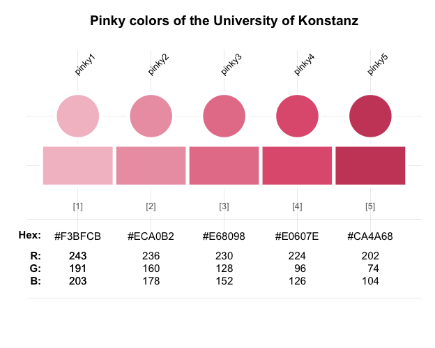

#### Comparing color palettes

When `seecol()` is used with a recognized keyword or a list of color
palettes, the function displays a comparison between them. When only
some colors of a color palette are requested, the `seecol()` and
`usecol()` functions provide reasonable subsets of a **unikn** palette:

``` r
# Compare a list of (scaled) color palettes: 
seecol(pal = "grad_all", n = 3, 
       col_brd = "black", lwd_brd = .5,
       main = "Color gradient palettes (scaled to n = 3)")
```

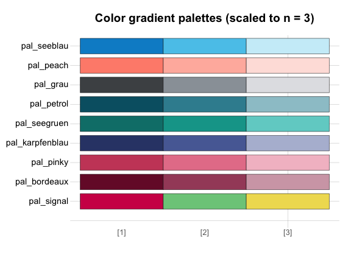

### Using color palettes with `usecol()`

Colors and color palettes in R come in various types (e.g., as named
colors, RGB values or Hex codes) and forms (e.g., as data frames or
vectors). The `usecol()` function provides a generic wrapper for
changing (e.g., mixing and re-scaling) and using color palettes. This
allows using colors in **base** R and most other R packages. For
instance, we can easily use colors in combination with

- the `barplot()` function of the **grDevices** package:

``` r
# Mix some colors into a new palette:
my_pal <- usecol(c(Seeblau, "white", Pinky), n = 9)

# Use color palette:
barplot(1/sqrt(1:9),  col = my_pal)
```

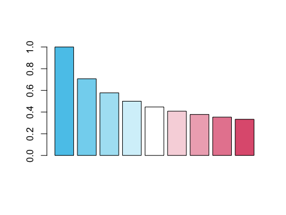

- the `image()` function of the **graphics** package (for geometric
  transformations of a vector `r`):

``` r
# Data:
x <- y <- seq(-4 * pi, 4 * pi, len = 15)
r <- sqrt(outer(x^2, y^2, "+"))

# Mix a palette with a named color:
my_col <- usecol(c(Seegruen, "white"), n = 7)

# Image:
image(z = cos(r^2) * exp(-r/10), 
      col = my_col, axes = FALSE)
```


- the `ggplot()` function of the **ggplot2** package (for a data
  frame `df`):

``` r
# Data (based on https://www.r-graph-gallery.com/137-spring-shapes-data-art/):

n <- 50
groups <- 1:n
df <- data.frame()
set.seed(3)

for (i in seq(1:30)){
  data = data.frame(matrix(0, n, 3))
  data[, 1] <- i
  data[, 2] <- sample(groups, nrow(data))
  data[, 3] <- prop.table(sample(c(rep(0, 100), c(1:n)), nrow(data)))
  df = rbind(df, data)
  }

names(df) <- c("x","group","y")     # name variables
df$group <- as.factor(df$group)     # group as factor
df <- df[c(2, 1, 3)]                # order of variables
df <- df[order(df$x, df$group) , ]  # order of rows
```

``` r
# Mix a color gradient: 
my_col <- usecol(c(Bordeaux, "white", Petrol), n = 50)

# Plot (with ggplot2):
library(ggplot2)

ggplot(df, aes(x = x, y = y, fill = group)) + 
  geom_area() +
  scale_fill_manual(values = my_col) +
  theme_void() +
  theme(legend.position = "none")
```


#### Illustrating color palettes

The `demopal()` function provides a quick illustration of a pre-defined
or modified color palette:

``` r
demopal(usecol(pal_unikn_light, n = 7),  # use a modified color palette
        type = "curve", seed = 2)        # reproducible randomness
```

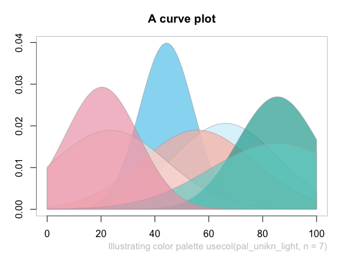

### Creating color palettes with `newpal()`

The `newpal()` function allows creating new color palettes (as data
frames or vectors, with optional color names). Whereas **unikn** was
developed in an academic context, color palettes for other entities and
purposes can easily be created. For instance, let’s define a color
palette of the well-known [Google](https://www.google.com/) logo in
3 steps:

1.  Choose some colors (from named R colors, or by RGB/HEX/HCL values,
    e.g., from sites like <https://www.schemecolor.com>).

2.  Define the colors (and optional color names) as R vectors (of type
    character).

3.  Use the `newpal()` command to define a new color palette.

We can now use the new palette in visualizations (e.g., inspect it with
the `seecol()` function, use it in visualizations, or modify it further
with the `usecol()` function):

``` r
# 1. Choose colors:
# Google logo colors (from <https://www.schemecolor.com/google-logo-colors.php>)

# 2. Define colors and color names (as vectors):
color_google <- c("#4285f4", "#34a853", "#fbbc05", "#ea4335")
names_google <- c("blueberry", "sea green", "selective yellow", "cinnabar")

# 3. Define color palette:
pal_google <- newpal(color_google, names_google)

# Inspect color palette:
seecol(pal_google, 
       col_brd = "white", lwd_brd = 8,
       main = "Colors of Google")
```

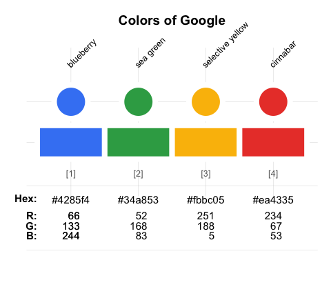

See the vignette on [Institutional
colors](https://hneth.github.io/unikn/articles/color_inst.html) for
additional examples of creating color palettes.

### Finding colors

When creating visualizations, we often face two search situations:

- Finding colors that look similar to a given color
- Finding colors that match particular names

The `simcol()` and `grepal()` functions of **unikn** address both
situations.

#### Finding similar colors with `simcol()`

- Which R colors are similar to the color `Pinky` (or `pinky4` of the
  `pal_pinky` palette)?

``` r
simcol(col_target = Pinky, tol = 30)
```

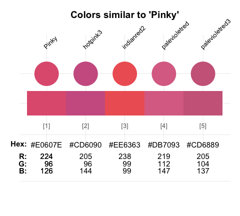

    #>            Pinky         hotpink3       indianred2    palevioletred 
    #>        "#E0607E"       "hotpink3"     "indianred2"  "palevioletred" 
    #>   palevioletred3 
    #> "palevioletred3"

By default, `simcol()` considers all unique named `colors()` of R, but
its search range can be adjusted by its `col_candiates`, `tol`, and
`distinct` arguments.

#### Finding color names with `grepal()`

The `grepal()` function allows finding colors by matching their name to
a pattern.

Specifically, `grepal(pattern, x)` searches a color palette `x` (i.e., a
vector of color names or data frame of named colors) for elements that
match a `pattern` and returns those elements (colors) that match the
pattern. The `pattern` can be a regular expression.

By default, `grepal()` searches the 657 named colors provided by
`colors()` in **base** R. To make the `grepal()` more flexible, its
`pattern` argument can use regular expressions:

``` r
# Find colors matching a pattern: 
deep_purple <- grepal(pattern = "deep|purple", plot = FALSE)

# See color palette:
seecol(deep_purple, 
       col_brd = "white", lwd_brd = 2, 
       main = "Finding 'deep' or 'purple' colors")
```

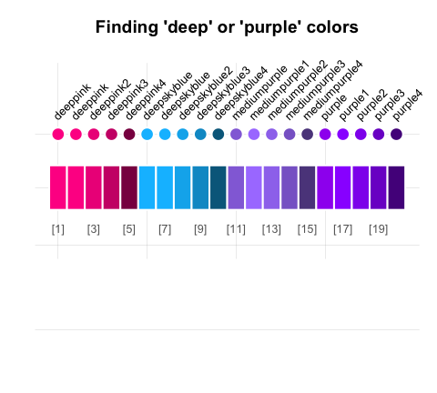

Providing a list of color palettes to the `pal` argument of `seecol()`
allows comparing multiple color palettes:

``` r
# Find colors matching some term(s):
olives  <- grepal("olive", plot = FALSE)
oranges <- grepal("orange", plot = FALSE)

# See color palettes:
seecol(pal = list(olives, oranges), 
       pal_names = c("olives", "oranges"), 
       main = "Comparing olives with oranges")
```

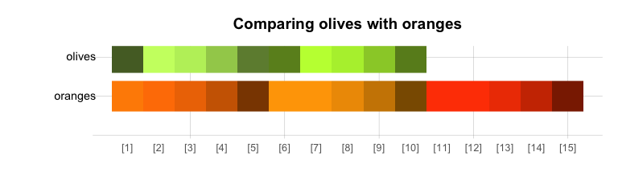

See the vignette on [Colors and color
functions](https://hneth.github.io/unikn/articles/colors.html) and
[Color
recipes](https://hneth.github.io/unikn/articles/color_recipes.html) for
additional examples.

## Text decorations

Beyond colors and color functions, **unikn** provides functions for
plotting graphical elements (like boxes) and styled text elements (with
lines or background decorations). By default, the text-decoration
functions assume that you want to add styled text to an existing plot,
unless the `new_plot` argument specifies a type of plot to be generated.
As the use of these functions is explained in detail in the vignette on
[Text boxes and
decorations](https://hneth.github.io/unikn/articles/text.html), we only
provide some examples here.

### Mark

The `mark()` function allows emphasizing text by plotting it with
colored background (to provide the functionality of “Markieren”):

``` r
mark(labels = c("Markieren", "ist ein Bestandteil", "von Studieren."), 
     x = 0, y = .8, y_layout = .03, cex = 1.5, new_plot = "slide")
```


### Underline

The `uline()` function allows emphasizing text by plotting it with
colored underlining (to provide the functionality of “Unterstreichen”):

``` r
uline(labels = c("Linear", "Authentic", "Flexible", "Open", "Practical"), 
      x = .05, y = .9, y_layout = "even", cex = 1.1, font = 2, new_plot = "slide")
```


### Post

The `post()` function allows adding text to a rectangular `xbox` (to
provide the functionality of “Merken”):

``` r
xbox(col = usecol(pal_seeblau[[5]]), dim = c(2, 2))
post(labels = c("Für eine", "Kultur der", "Kreativität"), x = .1, y = .8, cex = 1.4, font = 2)
```


The color and font parameters can be adjusted to obtain different looks:

``` r
post(labels = c("creative.", "together"), new_plot = "xbox", 
     y_layout = .02, cex = 2, font = c(1, 3),  
     col_bg = pal_seegruen[[1]], col = c(Petrol, Pinky))
```

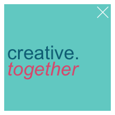

### Headings

The `heading()` function is a convenient wrapper around `mark`:

``` r
heading(labels = c("pa-", "ra-", "die-", "sisch"))
```


### URLs

Finally, the `url_unikn()` function allows formatting URLs the uni.kn
way:

``` r
my_url <- url_unikn("https://www.uni-konstanz.de/")  # input URL as copied from web browser

post(labels = my_url, x = .2, y = .1, font = 4, new_plot = "xbox")
```


### Using custom color palettes

All **unikn** color palettes and user-generated color palette (e.g.,
defined by `newpal()` or `usecol()`) can be used for graphical
annotations. For example:

<!-- - Using the color palettes of academic institutions (see the vignette on [Institutional colors](https://hneth.github.io/unikn/articles/color_inst.html)) with text decoration functions:  -->

- Using the color palette `pal_google` (defined above):


See the vignette on [Text boxes and
decorations](https://hneth.github.io/unikn/articles/text.html) for
instructions and additional examples.

### Caveats

Please note the following caveats:

- Plotting text (i.e., graphically rendering characters) is rarely a
  good idea. It typically doesn’t scale (when changing the size of
  images) and cannot be recognized automatically (e.g., copied, indexed,
  or scraped). Hence, the corresponding **unikn** functions should only
  be used in contexts in which no better solutions are available or
  practical (e.g., when specifically creating images, or adding
  annotations to graphs).

- Our templates — just like all others — are subject to constraints and
  limitations. As a standard installation of R lacks the “Theinhardt”
  fonts, we can only mimic the official design specifications (in Arial,
  sans serif). Nevertheless, the **unikn** package helps preventing
  common mistakes by novices (e.g., boxes or lines extending beyond
  text, or step-functions in multi-line titles) and can be customized
  and improved by expert users.

Overall, the **unikn** functions can be useful for solving color-related
tasks and plotting graphical elements (e.g., boxes, logos, etc.).
Ideally, it should help you in creating a stylish and recognizable
design for your presentations and visualizations.

## ToDo


The **unikn** and
**[unicol](https://CRAN.R-project.org/package=unicol)** packages are
still under development. We are currently working on:

- Adding institutional color palettes to the
  **[unicol](https://CRAN.R-project.org/package=unicol)** package
- Additional templates and themes (for plots and text decoration)

Please comment on [GitHub](https://github.com/hneth/unikn) or [contact
us](https://www.spds.uni-konstanz.de/) if you need additional features
or want to help creating them.

## Resources

The following versions of **unikn** and corresponding resources are
currently available:

| Type:                     | Version:                                                    | URL:                                       |
|:--------------------------|:------------------------------------------------------------|:-------------------------------------------|
| A. **unikn** (R package): | [Release version](https://CRAN.R-project.org/package=unikn) | <https://CRAN.R-project.org/package=unikn> |
|                           | [Development version](https://github.com/hneth/unikn/)      | <https://github.com/hneth/unikn/>          |
| B. Online documentation:  | [Release version](https://hneth.github.io/unikn/)           | <https://hneth.github.io/unikn/>           |
|                           | [Development version](https://hneth.github.io/unikn/dev/)   | <https://hneth.github.io/unikn/dev/>       |

## Contact

Please note and report any **unikn**-related issues at
<https://github.com/hneth/unikn/issues>. We are looking forward to your
feedback, comments, or questions.

## Copyrights

<!-- uni.kn logo and link: -->
<!--  -->

<a href = "https://www.uni-konstanz.de/">

</a>

The [University of Konstanz’s Corporate
Design](https://www.uni-konstanz.de/en/university/news-and-media/create-online-and-print-media/corporate-design/) (CD)
was created by [Strichpunkt GmbH](https://www.strichpunkt-design.de/)
and the [University of Konstanz](https://www.uni-konstanz.de/) in 2014.
The **unikn** package authors are members of the research group [Social
Psychology and Decision Sciences](https://www.spds.uni-konstanz.de/)
(SPDS) at the [University of Konstanz](https://www.uni-konstanz.de/). We
facilitate access to CD elements for fellow users of R (e.g., for
creating scientific visualizations), but all copyrights on the design
remain with the original copyright holders.

We aim for an authentic representation of a highly-specified corporate
design. While rigid specifications help to maintain coherence and
consistency, they also tend to cause frustration in expert users. As the
design has been developed in a flexible way that allows for individual
elements to be modified as needed, we allow for some liberties, mostly
by relaxing some restrictions. Examples include:

- enabling finer color gradients and arbitrary combinations of color
  palettes (by applying the `seecol()` and `usecol()` functions to color
  palettes);  
- providing a designated `Signal` color (from `pal_signal`);  
- using the spelling “color” (rather than “colour”) throughout the
  **unikn** package.

### License

<!-- unikn pkg logo and link: -->

<a href = "https://CRAN.R-project.org/package=unikn">

</a>

<!-- License: CC BY-SA 4.0 (also in Description) -->
<!-- Image with link: -->

<a rel="license" href="https://creativecommons.org/licenses/by-sa/4.0/"></a>

<!-- Text with links: -->

<span xmlns:dct="https://purl.org/dc/terms/"
property="dct:title"><strong>unikn</strong></span> (created by
<a xmlns:cc="https://creativecommons.org/ns#" href="https://github.com/hneth/unikn" property="cc:attributionName" rel="cc:attributionURL">Hansjörg
Neth and Nico Gradwohl</a>) is licensed under a
<a rel="license" href="https://creativecommons.org/licenses/by-sa/4.0/">Creative
Commons Attribution-ShareAlike 4.0 International License</a>. (Based on
a work at
<a xmlns:dct="https://purl.org/dc/terms/" href="https://github.com/hneth/unikn" rel="dct:source">https://github.com/hneth/unikn</a>).

### Citation and References

To support our efforts, please cite the **unikn** package in derivations
or publications:

<!-- Citation / reference (in APA format): -->

- Neth, H., & Gradwohl, N., (2024). unikn: Graphical elements of the
  University of Konstanz’s corporate design.  
  Social Psychology and Decision Sciences, University of Konstanz,
  Germany.  
  Computer software (R package version 1.0.0, April 16, 2024).  
  Retrieved from <https://CRAN.R-project.org/package=unikn>.  
  doi [10.5281/zenodo.7096191](https://doi.org/10.5281/zenodo.7096191)

<!-- BibTeX:  -->

A BibTeX entry for LaTeX users is:

    @Manual{,
      title = {unikn: Graphical elements of the University of Konstanz's corporate design},
      author = {Hansjörg Neth and Nico Gradwohl},
      year = {2024},
      organization = {Social Psychology and Decision Sciences, University of Konstanz},
      address = {Konstanz, Germany},
      note = {R package (version 1.0.0, April 16, 2024)},
      url = {https://CRAN.R-project.org/package=unikn},
      doi = {10.5281/zenodo.7096191},
    }

<!-- Copyrights of designs: -->

The copyrights to all [uni.kn](https://www.uni-konstanz.de/) designs
remain with their original creators:

- [The University of Konstanz’s corporate
  design](https://www.uni-konstanz.de/en/university/news-and-media/create-online-and-print-media/corporate-design/the-university-of-konstanzs-corporate-design/)
  (Version 1.6, September 2015)  
- [Colours for complex
  graphics](https://www.uni-konstanz.de/en/university/news-and-media/create-online-and-print-media/corporate-design/colours-for-complex-graphics/)  
- Strichpunkt GmbH, [‒
  strichpunkt-design.de](https://www.strichpunkt-design.de/)

------------------------------------------------------------------------

<!-- Footer: -->

\[File `README.md` updated on 2024-04-16.\]

<!-- eof. -->
