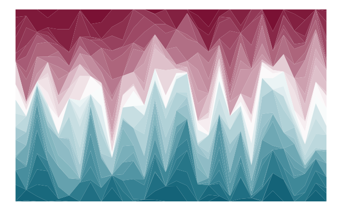

```{r setup, include = FALSE}
options(max.print = "75")

knitr::opts_chunk$set(echo = TRUE,
                      cache = FALSE,
                      prompt = FALSE,
                      tidy = FALSE,
                      collapse = TRUE, 
                      comment = "#>",
                      message = FALSE,
                      warning = FALSE,
                      # Default figure options:
                      # fig.width = 6, 
                      # fig.asp = .8 # .618, # golden ratio
                      fig.align = "center",
                      out.width = "60%")

# URLs: ------ 

# unikn / Uni Konstanz:
url_unikn <- "https://www.uni-konstanz.de"

# unikn package:
url_unikn_cran   <- "https://CRAN.R-project.org/package=unikn"
url_unikn_github <- "https://github.com/hneth/unikn"

# unicol package: 
url_unicol_cran   <- "https://CRAN.R-project.org/package=unicol"
url_unicol_github <- "https://github.com/hneth/unicol"
```

<!-- unikn pkg logo and link: -->
<a href = "https://CRAN.R-project.org/package=unikn">

</a>

This vignette shows how various color-related tasks can be solved by the tools provided by **unikn**. 
<!-- Main color info: --> 
(For a general introduction of the  **unikn** colors, color palettes, and color functions, see the vignette on [Colors and color functions](colors.html). The vignette on [text](text.html) provides information on creating text boxes and decorations.) 


The following recipes illustrate how plotting functions in R can use the colors and color palettes provided by the **unikn** package. 
Additional examples show how we can use the `seecol()`, `usecol()`, `newpal()`, and `grepal()` functions for solving color-related tasks. 

Please install and/or load the **unikn** package to get started: 

```{r load-pkg-colors, message = FALSE, warning = FALSE}
# install.packages('unikn')  # install unikn from CRAN client
library('unikn')             # loads the package
```


## Using colors in **base** R 

**Task:** Using **unikn** colors in visualizations created by **base** R graphics. 

When creating **base** R visualizations (e.g., using `plot()` for creating a scatterplot), 
use the `usecol()` function in combination with any color palette (e.g., `pal_unikn`) as the `col`\ argument: 

```{r plot-par-set, echo = FALSE}
opar <- par(no.readonly = TRUE)  # store current settings

par(mar = c(1, 1, 2.1, 1), oma = c(0, 0, 0, 0))  # reduce margins

set.seed(6 * pi)  # reproducible randomness
```


```{r demo-scatterplot, eval = TRUE, fig.width = 5, fig.asp=.95, fig.align = 'center', collapse = TRUE}
my_col <- usecol(pal_unikn, alpha = .50)  # with transparency

plot(x = runif(99), y = runif(99), type = "p", 
     pch = 16, cex = 4,
     col = my_col,
     main = "99 transparent dots", axes = FALSE, xlab = NA, ylab = NA)
```

```{r plot-par-reset, echo = FALSE}
par(opar)  # re-store current settings
```


## Using colors in **ggplot2**

**Task:** Using **unikn** colors in visualizations created by the **ggplot2** package.

When using the `ggplot()` function of **ggplot2** (e.g., for creating an area plot), 
use the `usecol()` function for defining a color palette (of the desired length and transparency) 
that is then provided as the `values` of the `scale_color_manual()` or `scale_fill_manual()` functions: 

1. Wrap the desired color palette in the `usecol()` function of **unikn**. 

2. Provide this palette as the `values` of the **ggplot2** functions `scale_color_manual()` or `scale_fill_manual()`. 

```{r use-pal-ggplot2, eval = FALSE, fig.width = 6, fig.asp = .618, fig.align = 'center', collapse = TRUE}
# 0. Create data: ---- 

# Example based on https://www.r-graph-gallery.com/137-spring-shapes-data-art/
n <- 50
groups <- 1:n
df <- data.frame()

set.seed(3)

for (i in seq(1:30)){
  data = data.frame(matrix(0, n, 3))
  data[, 1] <- i
  data[, 2] <- sample(groups, nrow(data))
  data[, 3] <- prop.table(sample(c(rep(0, 100), c(1:n)), nrow(data)))
  df = rbind(df, data)}

names(df) <- c("X","Group","Y")
df$Group <- as.factor(df$Group)  
df <- df[c(2, 1, 3)]
df <- df[order(df$X, df$Group) , ]
rownames(df) <- NULL

my_data <- df

# 1. Colors: ---- 

# A. using RColorBrewer: 
# library(RColorBrewer)

# cur_col <- brewer.pal(11, "Paired") 
# cur_col <- colorRampPalette(cur_col)(n)
# cur_col <- cur_col[sample(c(1:length(cur_col)), size = length(cur_col))]  # randomize

# B. using unikn colors:
library(unikn)

# Mix a color gradient: 
cur_col <- usecol(c(Bordeaux, "white", Petrol), n = n)
# cur_col <- cur_col[sample(c(1:length(cur_col)), size = length(cur_col))]  # randomize

# 2. Plotting: ---- 

library(ggplot2)

ggplot(my_data, aes(x = X, y = Y, fill = Group)) + 
  geom_area() +
  scale_fill_manual(values = cur_col) +
  theme_void() +
  theme(legend.position = "none")
```

<!-- Image from README (as HTML link): -->

<p style="text-align:center;">

</p>


## Viewing and comparing color palettes 

**Task:** Inspect (the colors and details of) a color palette. 

For easily viewing an individual color palette (e.g., provided by the new HCL color palettes `hcl.pals()` of\ R), 
use the palette as the `pal`\ argument of the `seecol()` function: 

```{r seecol-example-1, fig.width = 5, fig.asp = .80, fig.align = 'center'}
col_pal <- hcl.colors(10, "Vik")  # some color palette

seecol(col_pal)  # see its colors and details 
```

Note that the other arguments of the `seecol()` function ---\ especially `n` and `alpha`\ --- can modify the palette (in the same ways as the `usecol()` function). 


**Task:** Compare (the colors and range of) multiple color palettes. 

For comparing multiple color palettes (e.g., 20\ random color palettes of `hcl.pals()`), 
provide them as a list in the `pal`\ argument of the `seecol()`\ function. 

For instance, let's create and compare a set of 20\ random HCL palettes: 

```{r set-seed-HCL-pals, echo = FALSE}
set.seed(4 * pi)  # reproducible randomenss 
```

- Generate random HCL\ palettes (and save them as a list):

```{r seecol-example-2a, fig.width = 6, fig.asp = 1.0, fig.align = 'center'}
# Parameters:
n_col <-  8   # colors in each palette
n_pal <- 20   # length(hcl.pals())
ptype <- NULL # c("diverging", "divergingx", "qualitative", "sequential")[4] 

s_pal <- sample(x = hcl.pals(type = ptype), size = n_pal, replace = FALSE)
s_pal <- sort(s_pal)

# Initialize:
t_lbl <- paste0("See ", n_pal, " random HCL color palettes (n = ", n_col, ")") 
l_pal <- vector("list", n_pal)  # lists of palettes

# Loop:
for (i in 1:n_pal){
  
  l_pal[[i]] <- hcl.colors(n = n_col, palette = s_pal[i])
  
}
```

- Use `seecol()` for comparing multiple color palettes: 

```{r seecol-example-2b, fig.width = 6, fig.asp = 1.0, fig.align = 'center'}
seecol(pal = l_pal, 
       pal_names = s_pal,
       col_brd = "white", lwd_brd = 1,
       main = t_lbl)
```


## Finding similar colors

**Task:** Find a color that is similar to some given color.

Use the `simcol()` function for finding (and plotting/seeing) similar colors: 

```{r simcol-example-01, fig.width = 5, fig.asp = .90, fig.align = 'center', fig.show = "hold"}
simcol("forestgreen")
```

The `simcol()` function compares a require target color (`col_target`) with 
a set of candidate colors (`col_candidates`, set to `colors()` by default). 
Color similarity is defined in terms of the colors' pair-wise distances in RGB values. 
If this distance falls below some tolerance value(s) (`tol`), the corresponding `col_candidates` are shown and returned. 
Thus, increasing the tolerance value yields a wider range of colors:

```{r simcol-example-02, fig.width = 5, fig.asp = .90, fig.align = 'center', fig.show = "hold"}
simcol(col_target = "orange", col_candidates = pal_unikn_pref, tol = 150)
```

Specifying a vector of three `tol` values compares RGB dimensions in the order of their rank. 
This allows for more fine-grained similarity searches:

```{r simcol-example-03, fig.width = 5, fig.asp = .90, fig.align = 'center', fig.show = "hold"}
simcol(col_target = Seeblau, tol = c(20, 20, 80))
```


## Creating new color palettes 

**Task:** Create a new color palette (with color names).

The general steps for creating an new color palette (with dedicated color names) are: 

1. Choose some colors (and their R color names, or as RGB/HEX/HCL values, e.g., from sites like <https://www.schemecolor.com>). 

2. Define the colors as an\ R vector (of type character). 

3. Define optional color names as a second R vector (of type character). 

4. Use the `newpal()` command to define the new color palette (as an\ R data frame or vector). 

Once a new palette has been defined, it can be inspected (with `seecol()`) or further modified and used in visualizations (with `usecol()`): 

```{r newpal-example, fig.width = 5, fig.asp = .9, fig.align = 'center'}
# 1. Choose colors:
# Google logo colors (from <https://www.schemecolor.com/google-logo-colors.php>)

# 2. Define colors (as vector):
color_google <- c("#4285f4", "#34a853", "#fbbc05", "#ea4335")

# 3. Define color names (as vector):
names_google <- c("blueberry", "sea green", "selective yellow", "cinnabar")

# 4. Define color palette:
pal_google <- newpal(color_google, names_google)

# Inspect color palette:
seecol(pal_google, 
       col_brd = "white", lwd_brd = 8,
       main = "Colors of the Google logo")
```

The vignette on [Institutional colors](color_inst.html) provides additional examples for defining color palettes. 


## Finding colors by name 

**Task:** Find colors by matching their names to a pattern (as a regular expression). 

Here are some additional examples for using the `grepal()` function for finding colors by their names (or a pattern): 

```{r grepal-example-1, fig.width = 5, fig.height = 4, fig.align = 'center'}
# Get color palettes matching a pattern:
pal_1 <- grepal("orange", plot = FALSE)
pal_2 <- grepal("olive", plot = FALSE)
pal_3 <- grepal("white", plot = FALSE)

# See individual palettes:
# seecol(pal_1, main = "Hues of 'orange' colors()")
# seecol(pal_2, main = "Hues of 'olive' colors()")
seecol(pal_3, main = "Hues of 'white' colors()", col_bg = "grey90")
```

Providing a list of color palettes to the `pal` argument of the `seecol()` function allows comparing multiple color palettes: 

```{r grepal-example-2, fig.width = 6, fig.asp = .50, fig.align = 'center'}
# See multiple color palettes:
seecol(pal = list(pal_1, pal_2, pal_3), 
       pal_names = c("orange", "olive", "white"), 
       col_bg = "grey90")
```

The last example illustrates that (a)\ the `pattern`\ argument of `grepal()` can use regular expressions, and that (b)\ the `x`\ argument of `grepal()` works with vectors or data frames (e.g., the **unikn** color palettes). 

Let's compare different types of "blue", "orange", and "purple or violet" provided by the **grDevices** vector of named `colors()` with various shades of "blau", "pink", "peach" and "bordeaux" provided by **unikn** color palettes: 

```{r grepal-example-3, fig.width = 6, fig.align = .50, fig.align = 'center'} 
# Search colors() with specific patterns (in their names): 
blues    <- grepal("blue$", plot = FALSE)   # ending on "blue"
oranges  <- grepal("orange", plot = FALSE)  # containing "orange"
purpviol <- grepal("purple|violet", plot = FALSE)  # containing "purple" or "violet"

# Search unikn palettes for color names: 
blaus_1 <- grepal("blau", pal_unikn, plot = FALSE)
blaus_2 <- grepal("blau", pal_karpfenblau, plot = FALSE)
pinks <- grepal("pink", pal_pinky, plot = FALSE)
peach <- grepal("peach", pal_peach, plot = FALSE)
baux  <- grepal("bordeaux", pal_bordeaux, plot = FALSE)

# See multiple color palettes: 
seecol(list(blues, oranges, purpviol, 
            c(blaus_1, blaus_2, pinks, peach, baux)),
       pal_names = c("blues", "oranges", "purpviol", "unikn colors"),
       main ="Comparing custom color palettes")
```


## Getting shades of a color

**Task:** Get different shades of a specific color. 

The `shades_of()` function returns a vector of \code{n}\ colors that are shades 
(i.e., typically lighter or darker versions) of an\ initial color\ \code{col_1}. 

By default, `shades_of(n)` yields `n`\ shades ranging from `col_1 = "black"` to `col_n = "white` 
(i.e., `n`\ shades of grey): 

```{r shades-of-example-1, fig.width = 5, fig.asp = .90, fig.align = 'center'}
greys <- shades_of(10)
seecol(greys, main = "10 shades of grey")
```

By adjusting\ `n`, the initial color\ `col_1`, and/or the final color\ `col_n`, 
we can conveniently create simple color ranges: 

```{r shades-of-example-2, eval = FALSE, fig.width = 5, fig.asp = .90, fig.align = 'center'}
seecol(shades_of(4, Seeblau, "black"), main = "4 shades of Seeblau")
seecol(shades_of(5, "forestgreen"), main = "5 shades of 'forestgreen'")
```

Using `alpha` in the range $[0; 1]$ allows adjusting the transparency of the color gradient: 

```{r shades-of-example-3, fig.width = 5, fig.asp = .90, fig.align = 'center'}
wine_gold <- shades_of(4, Bordeaux, col_n = "gold", alpha = .75)
seecol(wine_gold, main = "5 transparent shades from Bordeaux to gold")
```


## Creating color gradients

**Task:** Creating color gradients. 

The `shades_of()` function is merely a convenient wrapper function for the `usecol()` function. 
Using the `pal` argument of `usecol()` allows defining more complex color gradients 
(e.g., by specifying more than two colors). 
For instance, to create a bi-polar (divergent) color palette, we could mix two main colors with "white" and then remove the middle color:

```{r gradient-example-1, fig.width = 5, fig.asp = .90, fig.align = 'center'}
# Create bi-polar color gradient (and remove 'white' middle color):
divergent_gradient <- usecol(pal = c("firebrick", "white", "steelblue"), n = 7)[-4]

seecol(divergent_gradient, main = "A bi-polar color palette")
```


## Resources

The following versions of **unikn** and corresponding resources are currently available: 

Type:                    | Version:           | URL:                           |         
:------------------------|:-------------------|:-------------------------------| 
A. **unikn** (R package): | [Release version](https://CRAN.R-project.org/package=unikn) | <https://CRAN.R-project.org/package=unikn> |
    &nbsp;                | [Development version](https://github.com/hneth/unikn/)       | <https://github.com/hneth/unikn/> | 
B. Online documentation:  | [Release version](https://hneth.github.io/unikn/)            | <https://hneth.github.io/unikn/> | 
    &nbsp;                | [Development version](https://hneth.github.io/unikn/dev/)    | <https://hneth.github.io/unikn/dev/> | 


## Vignettes

The following vignettes provide instructions and examples for using the **unikn** colors, color palettes, and functions: 

<!-- Table of vignettes: -->

<!-- unikn pkg logo and link: -->
<a href = "https://CRAN.R-project.org/package=unikn">

</a> 

| Nr.  | Vignette | Content    |        
| ---: |:---------|:-----------|
| 1. | [Colors](colors.html) | Colors and color functions |
| 2. | [Color recipes](color_recipes.html) | Recipes for color-related tasks |
| 3. | [Institutional colors](color_inst.html) | Creating color palettes for other institutions |
| 4. | [Text](text.html)     | Text boxes and decorations | 

<!-- eof. -->