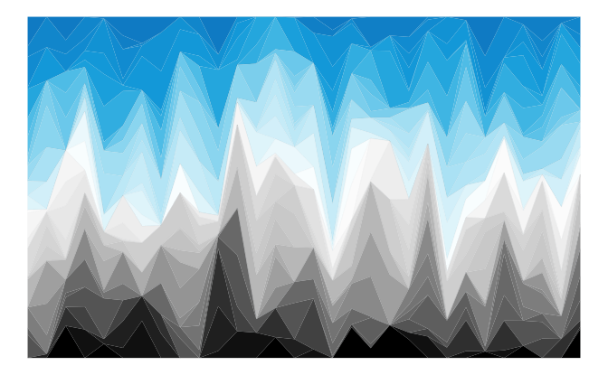

```{r setup, include = FALSE}
options(max.print = "75")
knitr::opts_chunk$set(echo = TRUE,
	             cache = FALSE,
               prompt = FALSE,
               tidy = FALSE,
               collapse = TRUE, 
               comment = "#>",
               message = FALSE,
               warning = FALSE,
               ## Default figure options:
               # fig.width = 7.2, 
               # fig.asp = .618, # golden ratio
               # out.width = "75%",
               fig.align = "center"
               )
```

This vignette explains which colors and color palettes are provided by **unikn** and how they can be accessed and used. 

## Overview 

Please load the **unikn** package to get started: 

```{r load_pkg, message = FALSE, warning = FALSE}
library(unikn)  # load unikn package
```

There are 2 functions to interact with the color palettes in the **unikn** package: `seecol()` and `usecol()`. 

1. The `seecol()` function is a general-purpose tool for viewing (or _seeing_) color palettes. `seecol` takes 2 main arguments:

    1. `pal` describes either 1 or multiple color palettes (with a default of `pal = "all"`);  
    2. `n` describes the number of desired colors (with a default of `n = "all"`).  

Based on the setting of `pal`, the `seecol` function distinguishes between 2 modes: 

* _comparing_ a set of color palettes by passing a keyword or `list`-object;  
* viewing the _details_ of a single color palette.   

2. The `usecol()` function allows using a color palette without showing its details. 


## Viewing and comparing available color palettes

The `seecol()` function shows multiple or the details of a single color palette. 
When the `pal` argument specifies (a list of) multiple color palettes, `seecol()` plots a vector for each palette to allow comparing these palettes. 
Some special keywords within the **unikn** package denote sets of color palettes: `"unikn_all"`, `"unikn_basic"`, `pair_all"`, `"pref_all"` and `"grad_all"`. Calling `seecol` with `pal` set to these keywords allows comparing pre-defined sets of the color palettes:   

Viewing _all_ available color palettes:

```{r seecol_unikn_all, fig.width = 7, fig.height = 6, fig.align = 'center'}
seecol("unikn_all")  # same as seecol("all")
```

1. three _basic_ color palettes:

```{r seecol_unikn_basic_2, fig.width = 7, fig.height = 2.5, fig.align = 'center'}
seecol("unikn_basic")
```

Note, that `pal_unikn_web` and `pal_unikn_ppt` are almost identical, but differ in how vibrant their colors are.  

2. three _paired_ color palettes:

```{r seecol_pair_all, fig.width = 7, fig.height = 2.5, fig.align = 'center'}
seecol("pair_all")
```

3. all _preferred_ colors from the spectrum and their respective _gradients_:

```{r seecol_pref_all, fig.width = 7, fig.height = 4, fig.align = 'center'}
seecol("pref_all")
```

4. only the pre-defined color _gradients_:

```{r seecol_grad_all_2, fig.width = 7, fig.height = 3.5, fig.align = 'center'}
seecol("grad_all")
```


## Viewing and saving a palette 

When the `pal` argument of the `seecol()` function specifies a single color palette, the function plots a more detailed view of this particular color palette: 

```{r unikn_palette, fig.width = 6, fig.asp = .75, fig.align = 'center'}
seecol(pal_unikn)  # view details of pal_unikn 
```

In the detailed overview, we _see_ 

- the color names (where available),  
- numeric indices of the color palette,   
- the HEX values of each color,   
- the RGB values for each color.  

A typical workflow may include _seeing_ a color palette, saving it, and using it in a plot.  

```{r save_seecol, fig.width = 6, fig.asp = .75, fig.align = 'center'}
my_pal <- seecol(pal_unikn_light)  # view details of AND save pal_unikn_light to my_pal  
```

After saving the color palette you can use the palette object in your plot: 

```{r my_pal_example, fig.width = 6, fig.asp = .618, fig.align = 'center'}
barplot(1/sqrt(1:10), col = my_pal)  # use my_pal in a plot
```

Note that `seecol()` _invisibly_ returns the color palette.  
Thus, the following will only plot the palette without doing anything else with the color vector:

```{r invisible_seecol, fig.width = 6, fig.asp = .75, fig.align = 'center'}
seecol(pal_bordeaux)
```

## Using a palette with `usecol` (without seeing it)

The `usecol()` function allows directly using a color palette in a plot (i.e., without first viewing it).
`usecol()` corresponds to `seecol()` by taking the same 2 main arguments (`pal` and `n`). 
However, as its purpose is _using_ the colors specified by `pal`, rather than plotting (or _seeing_) them, the `pal` argument typically contains only 1&nbsp;color palette:  

```{r use_col_default_use, fig.width = 6, fig.asp = .618, fig.align = 'center'}
# Using a color palette:
barplot(1/sqrt(1:11), col = usecol(pal_unikn))
```

Note that the both the `seecol` and the `usecol` function are quite permissive with respect to specifying their `pal` argument: 
A particular color palette (e.g., `pal_seegruen`) can not only be displayed by providing it (as an object) but also by providing its name (i.e., `"pal_seegruen"`) or even its incomplete object name or name (i.e., `"seegruen"` or `seegruen`). 
Hence, the following all yield the same result: 

```{r free_pal_args, fig.width = 6, fig.asp = .75, eval = FALSE}
seecol(pal_seegruen)
seecol("pal_seegruen")
seecol(seegruen)  # issues a warning
seecol("seegruen")
```

## Customizing color palettes

Both the `seecol()` and the `usecol()` functions allow a flexible on-the-fly customization of color palettes.  

Specifying a value for the `n` argument of `seecol` an `usecol` allows:  

- specifying subsets of colors and comparing these subsets for different palettes for `n` _smaller_ than the length of the color palette. 
- extending color palettes and comparing different palettes for `n` _greater_ than the length of the color palette. 

Passing a vector of colors and/or color palettes allows you creating and viewing your own palettes. 

<<<<<<< HEAD
Finally, specifying a value for `alpha` (in a range from 0 to 1) allows controlling the transparency of the color palette(s), with higher values for `alpha` corresponding to higher transparency (i.e., lower opacity). 
=======
Finally, specifying a value for `alpha` allows to control the transparency of the color palette(s) with higher values for `alpha` corresponding to higher transparency (lower opacity). 
>>>>>>> cf28d03afe620266ff16aae023a0d6ade1a45510

### Selecting subsets

Using only a subset of colors:

```{r use_subset, fig.width = 6, fig.height = 5, fig.align = 'center', collapse = TRUE}
seecol("unikn_all", n = 4)
seecol(pal_unikn, 4)
```

Importantly, when using pre-defined color palettes of **unikn** but a value of `n` that is smaller than the length of the current color palette, `usecol` and `seecol` select a predefined subset of colors:

```{r use_col_smalln, fig.width = 3.5, fig.height = 3, fig.align = 'center', collapse = TRUE, fig.show='hold'}
barplot(1/sqrt(1:2), col = usecol(pal_seeblau, n = 2))
barplot(1/sqrt(1:3), col = usecol(pal_seeblau, n = 3))
```


### Extending color palettes

For values of `n` that are larger than the number of available colors in `pal`, the specified color palette is extended using `ColorRampPalette`:

```{r use_superset_all, fig.width = 7, fig.height = 6, fig.align = 'center', collapse = TRUE}
seecol("all", n = 12)
```

```{r use_superset, fig.width = 6, fig.asp = .75, fig.align = 'center', collapse = TRUE}
seecol(pal_seeblau, 12)
```

When using a color palette: 

```{r use_col_big_n, fig.width = 6, fig.asp = .618, fig.align = 'center'}
barplot(1/sqrt(1:11), col = usecol(pal_bordeaux, n = 11))
```

### Mixing color palettes

By passing a vector to `pal`, we can concatenate 2 color palettes and connect them with a color (here: `"white"`) as the midpoint of a new color palette:  

```{r combine_pals, fig.width = 6, fig.asp = .75, fig.align = 'center'}
seecol(pal = c(rev(pal_petrol), "white", pal_bordeaux))
```

We can combine a set of colors and extend this palette by specifying an `n` argument that is larger than the length of the specified palette: 

```{r combine_pals_n, fig.width = 6, fig.asp = .75, fig.align = 'center'}
seecol(pal = usecol(c(Karpfenblau, Seeblau, "gold"), n = 10))
# Note, that redundant use of seecol and usecol shows HEX values as names.
# seecol(pal = c(Karpfenblau, Seeblau, "gold"), n = 10)  # would work, but show no intermediate names
```

These custom palettes can easily be used in a plot. For instance, we can define and use a subset of the `pal_unikn_pair` palette as follows: 

```{r use_my_pair, fig.width = 6, fig.height = 4, fig.align = 'center'}
my_pair <- seecol(pal_unikn_pair, n = 10)

# Create data: 
dat <- matrix(sample(5:10, size = 10, replace = TRUE), ncol = 5)

# Plot in my_pair colors:
barplot(dat, beside = TRUE, col = my_pair)
```

<<<<<<< HEAD
=======

### Controlling transparency

Displaying colors for opacity of 0.5:

```{r transparency1_pal, fig.width = 7, fig.height = 6, fig.align = 'center', collapse = TRUE}
seecol(pal_unikn, alpha = 0.5)
```

This also works for displays of multiple palettes: 

```{r transparency_all, fig.width = 6, fig.height = 3, fig.align = 'center'}
seecol("grad", alpha = 0.4)
```


### Comparing custom palettes 
>>>>>>> cf28d03afe620266ff16aae023a0d6ade1a45510

### Controlling transparency

Both `seecol()` and `usecol()` accept an `alpha` argument (in a range from 0 to 1) for controlling the transparency of color palettes, with higher values for `alpha` corresponding to higher transparency (i.e., lower opacity).

Displaying a specific color palette at an opacity of 0.5:

```{r transparency1_pal, fig.width = 6, fig.asp = .75, fig.align = 'center', collapse = TRUE}
seecol(pal_unikn, alpha = 0.5)
```

Setting opacity for comparing of multiple color palettes: 

```{r transparency_all, fig.width = 6, fig.height = 3, fig.align = 'center'}
seecol("grad", alpha = 0.67)
```


### Creating and comparing custom palettes 

Suppose we want to compare a newly created color palette to existing color palettes. To achieve this, advanced users can use the `seecol()` function for displaying and comparing different custom palettes. When provided with a list of color palettes as the input to its `pal` argument, `seecol()` will show a _comparison_ of the inputs:

```{r compare_custom_palettes, fig.width = 6, fig.height = 3, fig.align = 'center'}
# Define 2 palettes: 
pal1 <- c(rev(pal_seeblau), "white", pal_bordeaux)
pal2 <- usecol(c(Karpfenblau, Seeblau, "gold"), n = 10)

# Show the my_pair palette from above, the 2 palettes just defined, and 2 pre-defined palettes:  
seecol(list(my_pair, pal1, pal2, pal_unikn, pal_unikn_pair))
```

Note that unknown color palettes will be named `pal`n in increasing order. Palettes known to `seecol()` will be shown with their respective names.  

As before, we can use the `n` argument for obtaining shorter subsets of color palettes: 

```{r subset_compare, fig.width = 6, fig.height = 3, fig.align = 'center'}
seecol(list(my_pair, pal1, pal2, pal_unikn, pal_unikn_pair), n = 5)
```

or larger values of `n` for extending color palettes: 

```{r superset_compare, fig.width = 6, fig.height = 3, fig.align = 'center'}
seecol(list(my_pair, pal1, pal2, pal_unikn, pal_unikn_pair), n = 15)
```


## Examples

The following examples illustrate how plotting functions in R can use the **unikn** color palettes and the `seecol()` and `usecol()` functions. 

1. Using the `plot` function of **base R** for a scatterplot: 

<<<<<<< HEAD
```{r demo_scatterplot, eval = TRUE, fig.width = 5, fig.height = 5, fig.align = 'center', collapse = TRUE}
plot(x = runif(99), y = runif(99), "p", pch = 16, cex = 4, 
     col = usecol(pal_unikn, alpha = .50),  # with transparency
     main = "99 transparent dots", axes = FALSE, xlab = NA, ylab = NA)
=======
```{r demo_scatterplot, eval = TRUE, fig.width = 6, fig.height = 4, fig.align = 'center', collapse = TRUE}
plot(x = runif(200), y = runif(200), "p", pch = 16, cex = 4, 
     col = usecol(pal_unikn, alpha = .33))  # with transparency
>>>>>>> cf28d03afe620266ff16aae023a0d6ade1a45510
```

2. Using the `ggplot` function of **ggplot2** for an area plot: 

```{r use_pal_ggplot2, eval = FALSE, fig.width = 7, fig.asp = .618, fig.align = 'center', collapse = TRUE}
# Example based on https://www.r-graph-gallery.com/137-spring-shapes-data-art/ 

# (1) Create data: ---- 
ngroup <- 50
names <- paste("G_", seq(1, ngroup), sep = "")
df <- data.frame()

set.seed(3)
for(i in seq(1:30)){
    data = data.frame(matrix(0, ngroup, 3))
    data[, 1] = i
    data[, 2] = sample(names, nrow(data))
    data[, 3] = prop.table(sample( c(rep(0, 100), c(1:ngroup)), nrow(data)))
    df = rbind(df, data)}
colnames(df) <- c("X","group","Y")
df <- df[order(df$X, df$group) , ]

# (1) Choose colors: ---- 

# (a) using RColorBrewer: 
# library(RColorBrewer)
# cur_col <- brewer.pal(11, "Paired") 
# cur_col <- colorRampPalette(cur_col)(ngroup)
# cur_col <- cur_col[sample(c(1:length(cur_col)), size = length(cur_col))]  # randomize

# (b) using unikn:
library(unikn)
cur_col <- usecol(pal = pal_unikn, n = ngroup)
# cur_col <- cur_col[sample(c(1:length(cur_col)), size = length(cur_col))]  # randomize

# (3) Use ggplot2: ---- 

library(ggplot2)

ggplot(df, aes(x = X, y = Y, fill = group)) + 
  geom_area(alpha = 1, color = Grau, size = .01 ) +
  scale_fill_manual(values = cur_col) +
  theme_void() +
  theme(legend.position = "none")
```




## All unikn vignettes

<!-- unikn pkg logo and link: -->
<a href = "https://github.com/hneth/unikn/">

</a>

<!-- Index of vignettes: -->

| Nr.  | Vignette | Content    |        
| ---: |:---------|:-----------|
| 1. | [Colors](colors.html) | Colors and color palettes | 
| 2. | [Text](text.html)     | Text boxes and decorations | 

<!-- eof. -->